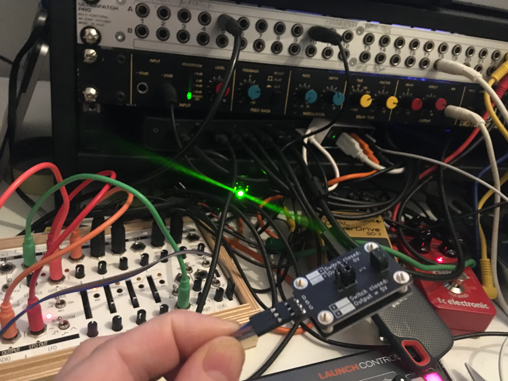
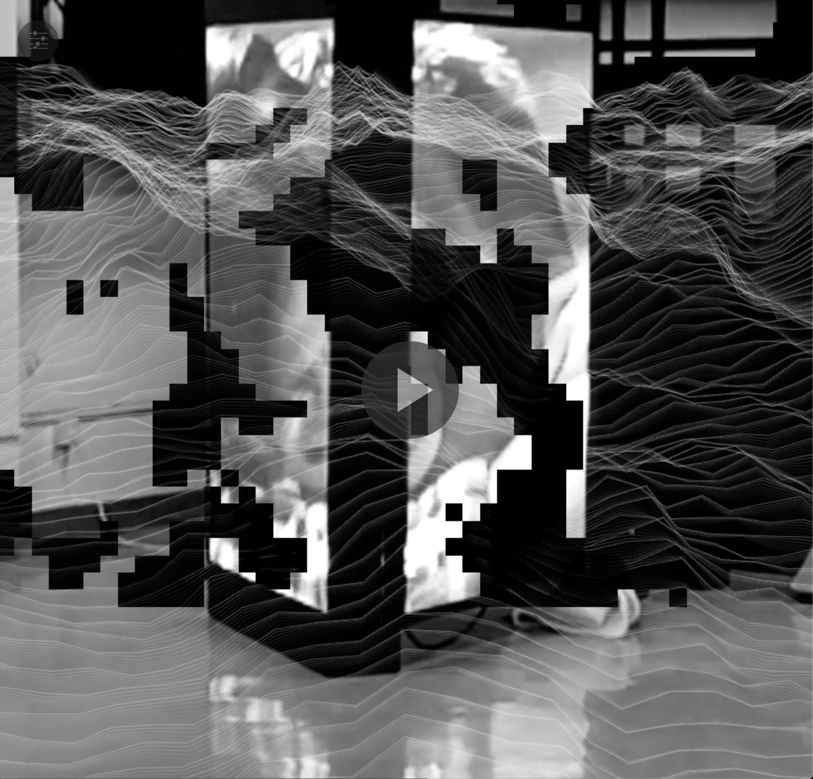
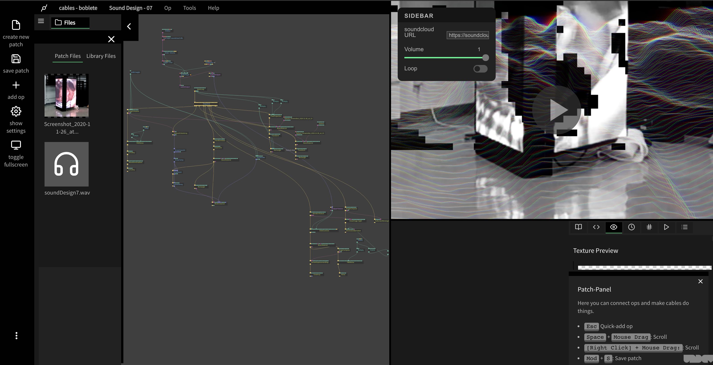
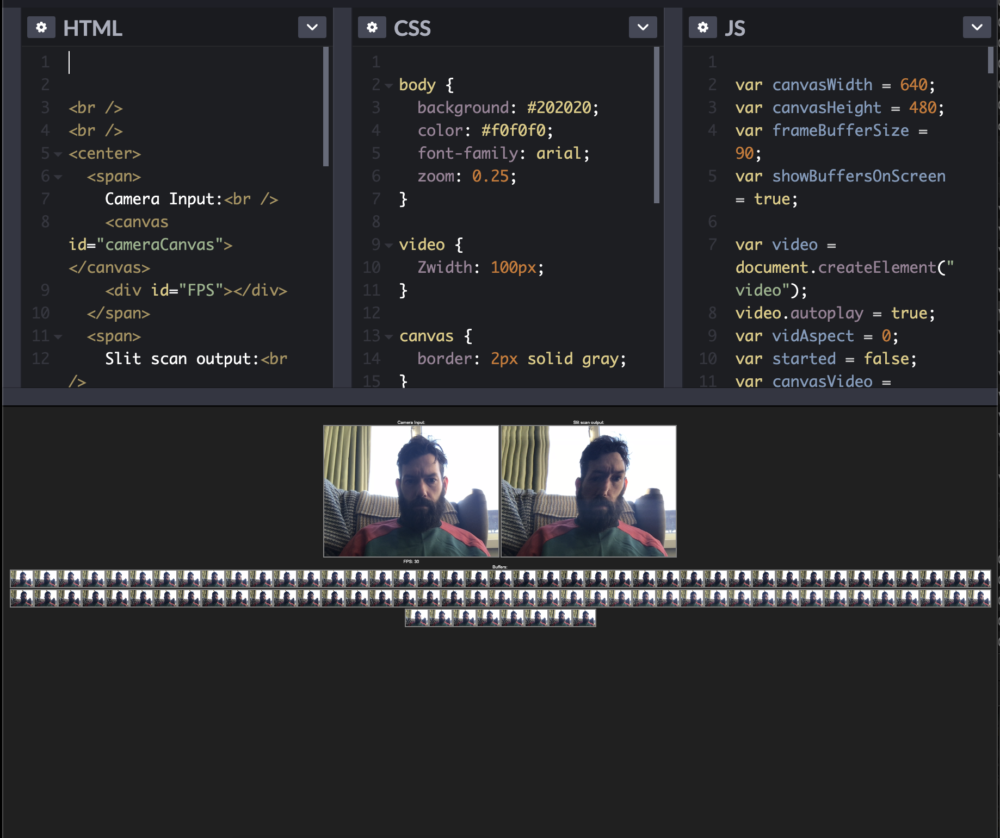
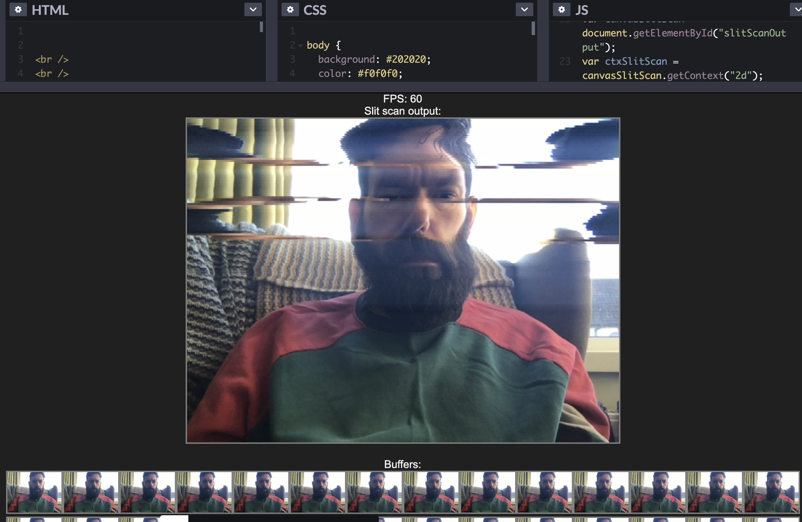

## Experiment 1
Date Sept 31 2019


What?
Choral Audio Test 01
[SOUNDCLOUD CHORAL](https://soundcloud.com/boblet/choral-audio-test-01/s-8kBu3)
<iframe width="100%" height="20" scrolling="no" frameborder="no" allow="autoplay" src="https://w.soundcloud.com/player/?url=https%3A//api.soundcloud.com/tracks/680500142%3Fsecret_token%3Ds-8kBu3&color=%2351864e&inverse=false&auto_play=false&show_user=true"></iframe><div style="font-size: 10px; color: #cccccc;line-break: anywhere;word-break: normal;overflow: hidden;white-space: nowrap;text-overflow: ellipsis; font-family: Interstate,Lucida Grande,Lucida Sans Unicode,Lucida Sans,Garuda,Verdana,Tahoma,sans-serif;font-weight: 100;"><a href="https://soundcloud.com/boblet" title="TAM (The Average Man)" target="_blank" style="color: #cccccc; text-decoration: none;">TAM (The Average Man)</a> · <a href="https://soundcloud.com/boblet/choral-audio-test-01/s-8kBu3" title="Choral Audio Test 01" target="_blank" style="color: #cccccc; text-decoration: none;">Choral Audio Test 01</a></div>

I created a choral audio test - based on some white noise and manipulated samples of the voice. The initial idea is to look at giving a computer a multiplicious voice. I wanted to see if I could create something that wouldnt be too boring that created the sound of the machine and was obviously mechanical but using generated phonemes sampled and sequenced.


#### Concept - Why did I do this?
In order to understand the aesthetics of machine voices.


#### Ambition - Why does this matter?
To give the machines voiuces is to reveal them - what is the aesthetic nature of these voices?


#### Results - 
I personally like the results - however the response from the group triggered a range of emotions :

Boredom from some -  I can agree
Others thought it too continuous….that there was no breath to the voices
This is an interesting comment and maybe that makes it the machine. THe idea of a lack of breath could be useful in hiding any humanity in a voice - is this more powerful than a glitch in the imagination? Maybe not but an interesting concept.
---

## Experiment 2
Date 2 Oct 2019

### What was done
[Mini mix](https://soundcloud.com/boblet/dmsa-listening-guide-minimix)
<iframe width="100%" height="20" scrolling="no" frameborder="no" allow="autoplay" src="https://w.soundcloud.com/player/?url=https%3A//api.soundcloud.com/tracks/692661133%3Fsecret_token%3Ds-pN5Pv&color=%2351864e&inverse=false&auto_play=false&show_user=true"></iframe><div style="font-size: 10px; color: #cccccc;line-break: anywhere;word-break: normal;overflow: hidden;white-space: nowrap;text-overflow: ellipsis; font-family: Interstate,Lucida Grande,Lucida Sans Unicode,Lucida Sans,Garuda,Verdana,Tahoma,sans-serif;font-weight: 100;"><a href="https://soundcloud.com/boblet" title="TAM (The Average Man)" target="_blank" style="color: #cccccc; text-decoration: none;">TAM (The Average Man)</a> · <a href="https://soundcloud.com/boblet/dmsa-listening-guide-minimix/s-pN5Pv" title="DMSA Listening Guide / MiniMix" target="_blank" style="color: #cccccc; text-decoration: none;">DMSA Listening Guide / MiniMix</a></div>

#### Concept - Why did I do this?
I wanted to create a little point of reference to my historic work to ensure that aesthetically I do not (or do) deviate from the work that has come before. This contains work from early work as [The Average Man](https://open.spotify.com/artist/3boQxzuvkSpIRhX3JfNJeF?si=mBkz4unTRxaen9njjU58zw) 
<iframe src="https://open.spotify.com/embed/artist/3boQxzuvkSpIRhX3JfNJeF" width="300" height="380" frameborder="0" allowtransparency="true" allow="encrypted-media"></iframe>
through to [Lil Bo Bleep](https://soundcloud.com/lil-bo-bleep) work and then installation and hack work.

#### Ambition - Why does this matter?
I wanted to maintain some core aesthetics from previous projects. A listening reference is useful to diverge or build on previous output.

#### Results - 
I can already see by adding in the last experiment that to the end of the mix that I need to be more aggressive in my sound choices, I wanted to look back at my work to see what still resonated, as well as share the results with the group. Unfortunately this did not occur but it is still useful for introverted listening.

---

## Experiment 3
Date 10 OCt 2019

### What was done?
Live jam with new sounds alongside my normal pallet of sounds to refind the work that I was doing before. Utilising my live set with some of the washes from previous experiments and using some fm synth work with heavy overdrive I created some other controllers using theramins as input.
[FUZZ FM OVERDRIVE](https://soundcloud.com/boblet/first-fuzz-fm-overdrive/s-09NVJ)
<iframe width="100%" height="20" scrolling="no" frameborder="no" allow="autoplay" src="https://w.soundcloud.com/player/?url=https%3A//api.soundcloud.com/tracks/693465352%3Fsecret_token%3Ds-09NVJ&color=%2351864e&inverse=false&auto_play=false&show_user=true"></iframe><div style="font-size: 10px; color: #cccccc;line-break: anywhere;word-break: normal;overflow: hidden;white-space: nowrap;text-overflow: ellipsis; font-family: Interstate,Lucida Grande,Lucida Sans Unicode,Lucida Sans,Garuda,Verdana,Tahoma,sans-serif;font-weight: 100;"><a href="https://soundcloud.com/boblet" title="TAM (The Average Man)" target="_blank" style="color: #cccccc; text-decoration: none;">TAM (The Average Man)</a> · <a href="https://soundcloud.com/boblet/first-fuzz-fm-overdrive/s-09NVJ" title="First Fuzz (FM OVERDRIVE)" target="_blank" style="color: #cccccc; text-decoration: none;">First Fuzz (FM OVERDRIVE)</a></div>

#### Concept - Why Did I do this?
To try and find a more active sound pallet that is more in keeping with my previous work - experiment with some new synthesizers

#### Ambition - Why does this matter?
I wish to build on my work rather than reinvent the sound pallet completely. 

#### Results - 
The results are much more aesthetically pleasing. It maintains my connection to club culture that was missing, but I feel that the sound could be pushed further. The use of a guitar as an instrument and the theremin reflect some of the work I am trying to build with, but its not in keeping wioth the concept.
---

## Experiment 4
Date 30 OCT 2019

#### What did I do?
Utilising Lyrebird as a voice generation program….
[Voice](https://soundcloud.com/boblet/8-audio-0001-2019-10-24-221956)
<iframe width="100%" height="20" scrolling="no" frameborder="no" allow="autoplay" src="https://w.soundcloud.com/player/?url=https%3A//api.soundcloud.com/tracks/701266948%3Fsecret_token%3Ds-4YPwb&color=%2351864e&inverse=false&auto_play=false&show_user=true"></iframe><div style="font-size: 10px; color: #cccccc;line-break: anywhere;word-break: normal;overflow: hidden;white-space: nowrap;text-overflow: ellipsis; font-family: Interstate,Lucida Grande,Lucida Sans Unicode,Lucida Sans,Garuda,Verdana,Tahoma,sans-serif;font-weight: 100;"><a href="https://soundcloud.com/boblet" title="TAM (The Average Man)" target="_blank" style="color: #cccccc; text-decoration: none;">TAM (The Average Man)</a> · <a href="https://soundcloud.com/boblet/8-audio-0001-2019-10-24-221956/s-4YPwb" title="8 - Audio 0001 [2019 - 10 - 24 221956]" target="_blank" style="color: #cccccc; text-decoration: none;">8 - Audio 0001 [2019 - 10 - 24 221956]</a></div>
I recorded over 40 readings in order to generate a voice clone via AI Software Lyrebird.

#### Concept - Why Did I do this?
I want to be able to give voice to machines - and I thought that some tests with actual machine generated voices could be useful.

#### Ambition - Why does this matter?
I am looking to capture participants voices - currently this has been touted as a fast way to create machine generated voices...


#### Results
I was hoping that the voices would be more like myself - however currently they are far too synthetic. Any quality is MASKED by the digital nature of the voices… This definitely feels like technology on the cusp - but still that - I only hear glimpses of myself in the voices - and others don't hear me at all. 

---
## Experiment 5
Date 4 Nov 2019

### What did I do?
[Slit scan experiment](https://youtu.be/LSviEkwfoZg)
<iframe width="560" height="315" src="https://www.youtube.com/embed/LSviEkwfoZg" frameborder="0" allow="accelerometer; autoplay; clipboard-write; encrypted-media; gyroscope; picture-in-picture" allowfullscreen></iframe>

Utilising Processing I wanted to look at the visual aspect of the work - slit scanning is a great tool for playing with time - and to hook a user IN - if they are to improvise with a space then they need to feel like they are playing.

#### Concept - Why did I do this?
I want to record people in time and get them to move their movement and behavior being used to generate and alter the composition. - for them to react I need something ‘fun’ just as the major sp’s like google  use services to extract behavior as a surplus.I built a series of magic ‘mirrors’ that look at video over time...

#### Ambition - Why does this matter?
Interaction needs investment and encourages a playful audience this is a way that reveals recording in a playful way.

#### Results - 
The slit scan is a great part as it utilises the body as its input and shows that people are being recorded. It had my kids dancing infrnt of it for some time so the playfulness is there - but without the extra layer of interaction it feels passive.
---

## Experiment 6
Date 7 Nov 2019

### What did I do?




Live jam with some body controled modular synths built in RACK and processing - experimenting with some contact controllers into my [Koma Electonic](https://koma-elektronik.com/?product=field-kit) Field kit. This is triggering some CV controls into a Volca Modular.

I reworked this into a composition:
[Middle Rhythm 2](https://soundcloud.com/boblet/middlerhythm-02)
<iframe width="100%" height="20" scrolling="no" frameborder="no" allow="autoplay" src="https://w.soundcloud.com/player/?url=https%3A//api.soundcloud.com/tracks/707908156%3Fsecret_token%3Ds-Gm9p8&color=%23862c43&inverse=false&auto_play=false&show_user=true"></iframe><div style="font-size: 10px; color: #cccccc;line-break: anywhere;word-break: normal;overflow: hidden;white-space: nowrap;text-overflow: ellipsis; font-family: Interstate,Lucida Grande,Lucida Sans Unicode,Lucida Sans,Garuda,Verdana,Tahoma,sans-serif;font-weight: 100;"><a href="https://soundcloud.com/boblet" title="TAM (The Average Man)" target="_blank" style="color: #cccccc; text-decoration: none;">TAM (The Average Man)</a> · <a href="https://soundcloud.com/boblet/middlerhythm-02/s-Gm9p8" title="MiddleRhythm 02" target="_blank" style="color: #cccccc; text-decoration: none;">MiddleRhythm 02</a></div>

#### Concept - Why Did I do this?
To see what kind of sounds were created by using the body as a controller - and if they can be tuned to an existing composition. Utilising signal data to control synthesis.

#### Ambition - Why does this matter?
I was hoping that sensors would work - but without experience this isnt conducive - it also is not passive but active - I feel like the machine should react to motion and vibrations in the room as much as sound and vision - to give it another sense

#### Results - 
Nice composition but the controllers seem too sporadic uncontrollable and fraught with failure-  great for sound design - but unusable for the general public unless subtle or desensitized - for example: a background pad with its subtle lfo's mapped to parameters.
---
## Experiment Date 10 Nov 2019

### What was done
SO here is a first Sonification test in processing
[Matching video and data mapped to a synth…](https://youtu.be/RQ1XXCvKtXQ)
<iframe width="560" height="315" src="https://www.youtube.com/embed/RQ1XXCvKtXQ" frameborder="0" allow="accelerometer; autoplay; clipboard-write; encrypted-media; gyroscope; picture-in-picture" allowfullscreen></iframe>

#### Concept - Why Did I do this?
Utilising slit scan words and sound to create immersion - alongside generated compositions taken from the Kinect reading depth within the room

#### Ambition - Why does this matter?
How does reactive sound change the experience? 

#### Results 
Its definitely interesting - but the composition is too threatening - no one would be drawn in. The words being distorted by the depth camera is something that might make it into the final piece - the idea that it is also

## Experiment Date 07 March 2020

### What was done
So taking samples recorded of followers I started to build synths using their voices
Test of allot of the sound design so far - almost all the sounds come from 2 sources - processed sounds of my own social media followers telling me that they are watching me - the other is from foley field recordings from data centers captured by various sources. - The modulations / automations of the tracks / synths are handled by custom facial recognition software.

All of the reverbs used are from impulse responses from Teufelsberg - an NSA listening tower
https://soundcloud.com/boblet/watching-test/s-oDhhEz8f3mc
<iframe width="100%" height="166" scrolling="no" frameborder="no" allow="autoplay" src="https://w.soundcloud.com/player/?url=https%3A//api.soundcloud.com/tracks/825847699%3Fsecret_token%3Ds-oDhhEz8f3mc&color=%23e6bdcb&auto_play=false&hide_related=true&show_comments=true&show_user=true&show_reposts=false&show_teaser=false"></iframe><div style="font-size: 10px; color: #cccccc;line-break: anywhere;word-break: normal;overflow: hidden;white-space: nowrap;text-overflow: ellipsis; font-family: Interstate,Lucida Grande,Lucida Sans Unicode,Lucida Sans,Garuda,Verdana,Tahoma,sans-serif;font-weight: 100;"><a href="https://soundcloud.com/boblet" title="TAM (The Average Man)" target="_blank" style="color: #cccccc; text-decoration: none;">TAM (The Average Man)</a> · <a href="https://soundcloud.com/boblet/watching-test/s-oDhhEz8f3mc" title="Watching Test 003" target="_blank" style="color: #cccccc; text-decoration: none;">Watching Test 003</a></div>

(NB extra rerender here)
https://soundcloud.com/boblet/6-audio-2-2020-10-23-080038-im-watching-you-startup-sample/s-415ko6vzFZa
<iframe width="100%" height="20" scrolling="no" frameborder="no" allow="autoplay" src="https://w.soundcloud.com/player/?url=https%3A//api.soundcloud.com/tracks/968810032%3Fsecret_token%3Ds-415ko6vzFZa&color=%23e6bdcb&inverse=false&auto_play=false&show_user=true"></iframe><div style="font-size: 10px; color: #cccccc;line-break: anywhere;word-break: normal;overflow: hidden;white-space: nowrap;text-overflow: ellipsis; font-family: Interstate,Lucida Grande,Lucida Sans Unicode,Lucida Sans,Garuda,Verdana,Tahoma,sans-serif;font-weight: 100;"><a href="https://soundcloud.com/boblet" title="TAM (The Average Man)" target="_blank" style="color: #cccccc; text-decoration: none;">TAM (The Average Man)</a> · <a href="https://soundcloud.com/boblet/6-audio-2-2020-10-23-080038-im-watching-you-startup-sample/s-415ko6vzFZa" title="6 - Audio 2 [2020 - 10 - 23 080038] - I&#x27;m Watching you startup Sample" target="_blank" style="color: #cccccc; text-decoration: none;">6 - Audio 2 [2020 - 10 - 23 080038] - I&#x27;m Watching you startup Sample</a></div>


#### Concept - Why Did I do this?
Can a voice be constructed from acts of sousveillance
#### Ambition - Why does this matter?
A new idea to hear what can be created 

#### Results 
Its definitely interesting - spooky but not really the aesthetic I was looking for - I am watching you is not a phrase that really I dshould have chosen

---

## Experiment 
Date Friday 28 FEB 2020

#### What
Lighting test Millimin 
#### Concept - Why Did I do this?
I want to create a surrounding entity to the interactions - a feeling of envelopment. I want to see if I can create reactions within millimin to control a simple dmx lighting rig and screen that reacts to. 

#### Ambition - Why does this matter?
I wanted to maintain focus in the installation drawing in - I have no experience with the DMX rig in the SDL - so I wished to use Millimin ad a brain for the lighting / projection of the installation. Learning a new piece of software - Millimum to see if it is useful. Millimin can take projections out of processing for projecting via syphon - this seems to work nicely - then utilising OSC you can control scenes.

#### Results - 
The experiment was slightkly unsuccesful there needs to be a smaller throw to the lights - maybe some LED strips would be more useful and control them - also the lighting effected the input of the Kinect something I was not anticipating - if lighting is to be used it should LIGHT the participants not sillhouette them - moving heads might be better but the univercity does not have any.


---

## Inspiration 
### Date August 1  2020
the bias and power imbalance of algorithms - Joy Buolamwini's websites a nice jumping off point as is [Kate Crawford](https://www.katecrawford.net/) her interview on Dryhursts & Herndons Interdependance podcast is a great listen

[Algorithmic Justice League - Unmasking AI harms and biases] (https://www.ajl.org/)
---
## Experiment 
Date Tuesday 6th October 2020

### What
[Facial recognition test](https://github.com/boblete/Facial-Recognition-Sonification-Test)

#### Ambition - Why does this matter?
After writing the thesis I now have more focus - I wish to explore sounds ability to target the body at a distance - facial recognition is one of the those issues that is plagued with bias and bad data. It is also another modern day silent observer, a secret power, that is known but unknown - ripe for a revealtion. To reveal it through sound is to give it a voice - to hear its presence - whether that be literal or metaphorical. Unclear as to what that would be - but the possibilities start with a hacking experiment - can I find a open source code solution that utilises biased data - but can be built upon. Turning to github returns a single JS library that looks perfect - and one that might have a virtual Covid-19 solution. 

#### Results - 
We can track faces in the browser with a webcam - this is successful - what is more interesting is the opensource hackable nature of the code. [Face-api.js](https://github.com/justadudewhohacks/face-api.js/) is used with various open source libraries that are part of the wider infrastructure that facial identification and feature extraction is built upon. This is also open source as is the image sets that the data is trained on - that will prove useful in revealing its true nature to an audience.

---

## Experiment 
Date Thursday 13th-sat 17th October 2020

### What
[Facial recognition test 2](https://github.com/boblete/frst-MA-DMSA)

#### Ambition - Why does this matter?
First test combining facial recognition software and react - the framework that I will use to help with basic UI display. Thius will form the backbone of the codebase for both a browser AND a installation piece.

#### Results 
So this is the first test at seeing if we can make the webapp porthin - the test is totally successful - I am able to make a fingerprint in data of faces based on FACE-API then test to see if the Algorhythm will find them again - this totally works - scanned every member of the family and having a full face recognition test - need to find the bias issues noted in the git-lab - the software allegedly fails on non-biased faces - we need to set a timeout on the camera / recognition connection  - and also if the face returns undefined then we request that they store them - 

This has sparked thoughts about how the app should work - the web portion should reveal and allow us to surrepticiously collect information about the user.

So we can get their IP address - 
We could ask them to post their fingerprint - sharing is an excellent circumnavigator of security as peoples willingness to sousveil themselves and share themselves will be key to gleaming information from them. -> shre location add nsa hashtag to a tweet along with a visual fingerprint.

What if the installation does nothing unless you sign up - your face goes ignored unless registered? what does that say? 

We should be able to give a multilayered effect - need to understand what each section of sound will be.

---
## Inspiration 
[Machine Listening festival](https://www.unsound.pl/en/intermission/machine-listening)
Excellent bunch of lectures by likeminded researchers.

2nd October - Re-watch here: Against The Coming World of Listening Machines

3rd October - Register here: Lessons In How (Not) To Be Heard 

4th October - Register here: Listening With The Pandemic

To quote Liquid Architecture: “Amidst oppressive and extractive forms of state and corporate listening, practices of collaborative study, experimentation and resistance will, we hope, enable us to develop strategies for recalibrating our relationships to machine listening, whether that be through technological interventions, alternative infrastructures, new behaviors, or political demands. With so many cultural producers - whose work and research is crucial for this kind of project - thrown into deeper precarity and an uncertain future by the unfolding pandemic, we also hope that this project will operate as a quasi-institution: a site of collective learning about and mobilisation against the coming world of listening machines.”

---
## Experiment 
Date Thursday 20th October 2020

### What
[Facial recognition test 003](https://github.com/boblete/frst-MA-DMSA)

#### Ambition - Why does this matter?
Trying to work out if I can get information out of the face api that I can use for instrumentation online

#### Results - 
Sucess - I can now map faces record face fingerprints and sonify them in tone.js - visualisation is handled by SVG graphics currently

[](https://www.youtube.com/watch?v=v_lw2GM6sqo)
It doesnt sound like my face currently - its  a mess really but fun.
---
## Experiment 
Date Thursday 20th October 2020

### What
Facial recognition test 003
https://github.com/boblete/frst-MA-DMSA

#### Ambition - Why does this matter?
This is a new branch to look at expression recognition data set - I can get it running internally with the recognition but extracting the data for my own uses is proving elusive - however might be able to GREP the output.

#### Results - 
Still not working need to understand how to test faces without just the UI output of FACEAPI framework - more learning will  be needed.


---
## Experiment 
Date saturday 23rd October 2020

What
[Facial recognition test 003 https://github.com/boblete/frst-MA-DMSA](https://github.com/boblete/frst-MA-DMSA)


#### Ambition - Why does this matter?
This is a new branch to look at expression recognition data set


#### Results - 
Still stumped - rolling back - but getting:


---
## Inspiration 
[hownormalami](https://www.hownormalami.eu/)
In this test face detection algorithms will determine how normal you are. 100% privacy friendly.

Excellent video based online art based on facial recognition algorhythms
---
## Workshop 
Date Tuesday 2nd November 2020
Hearing the Impossible with Matthew Herbert 

### What
THis workshop looking at scoring impossible sounds - what would those sounds be - the score I have created looks at the idea of the sounds that could be possible
[Full Score](https://docs.google.com/document/d/e/2PACX-1vS5Ps-nOxtMvAhwB6AkO9HxmTy3NkAGuvVg-vMKmyYusN1PAFhZitU1lRim27pNXF67h4jNN_SEukNv/pub)


This Method of working resonates with the way I like to work and outputs possibilities of new sounds within the imagination - which is exactly what I need to motivate me at this time.
---
## Experiment
Thursday 5th November 2020 MORNING
Facial recognition test 004 
#### Ambition - Why does this matter?
Trying to at least register all the features I can gleam from each moment
Changing the sound design to something more delicate so it draws the user in - something brutal reveals anger - but really if the user is KNOWN then it should draw them in with delicacy - the magic of prediction is what is intruiging here - can we play a CHORD based on emotion - can we create an algorithmic chord progression - something that moves through the whole circle in an upwards fashion - each time we get to a chord we trigger a face check for the 'next' chord - if it is operating correctly then we should be able to OVERLAY the last 2 if we can fade OUT 
Syncing the TIME to a tone timeline - 
It would be great if FINDING a face fingerprint changed the rhythm of the piece - if we are drawing grids COULD we have a bunch of tone instruments with teeny tiny samples in them that are triggered by the numbers? If we are mapping to grey scale simply then we can map to a midi value? 

#### Results
Now utilising vanvas parameter binding I can utilise the extra face API models to write out the labels:
also want to quickly use ffmpeg to create mp3 versions of ABLETON jams for aifs - this works
 for i in *.aif; do ffmpeg -i "$i" -vn -ar 44100 -ac 2 -b:a 192k "${i%.avi}.mp3"; done

 After playing with this for a while I am not hearing a face - the compositional instrument does not seem to sound like the mesh - so maybe I need something more delicate - I like the Idea of playing with really long delay times and fading the canvas back though time 


---
## Experiment
Thursday 5th November 2020 AFTERNOON
Facial recognition test 005 


#### Ambition - Why does this matter?
Fixing up the more compositional issues - and running things from TONE timelines...
All the timers are now tied to tone itself - the idea here is to run the engine through to TONE - as the ONLINE synthesis engine

#### What Happened?
The tests compiled properly with a few minor bugs.

#### What was revealed?

It sounds more musical  but Its too busy - there is sooo much data we need a way of shaping the sound not through pitch but through rhythm and texture.Or the data needs filtering
theres also a bug in 2 faces that shows up as an issue that I am only passing 1 variable to the face not splitting them - needs addressing that the labeling is uniform...

---
## Experiment 
Date Tuesday 10 November 2020

### What was done
Sound Design Test
[experiment-10-nov-01](https://soundcloud.com/boblet/experiment-10-nov-01/s-t3H9KG2PPXJ)

<iframe width="100%" height="300" scrolling="no" frameborder="no" allow="autoplay" src="https://w.soundcloud.com/player/?url=https%3A//api.soundcloud.com/tracks/926612206%3Fsecret_token%3Ds-x3NgkGGL7rT&color=%23ff5500&auto_play=false&hide_related=false&show_comments=true&show_user=true&show_reposts=false&show_teaser=true&visual=true"></iframe><div style="font-size: 10px; color: #cccccc;line-break: anywhere;word-break: normal;overflow: hidden;white-space: nowrap;text-overflow: ellipsis; font-family: Interstate,Lucida Grande,Lucida Sans Unicode,Lucida Sans,Garuda,Verdana,Tahoma,sans-serif;font-weight: 100;"><a href="https://soundcloud.com/boblet" title="TAM (The Average Man)" target="_blank" style="color: #cccccc; text-decoration: none;">TAM (The Average Man)</a> · <a href="https://soundcloud.com/boblet/experiment-10-nov-02/s-x3NgkGGL7rT" title="Experiment 10 nov 02" target="_blank" style="color: #cccccc; text-decoration: none;">Experiment 10 nov 02</a></div>


#### Ambition - Why does this matter?
Looking at sound design that explores the themes of Security in sound

#### Results - 
It has become more ambient - I am not too happy about the ups and downs of the chord progression - its too negative - some aspects of the glitchy sound design are hitting the spot for me - need to work more on the musical aspect - it needs to sound more pensive - more suspensful


---
## Experiment + Research
Date Tuesday 17 November 2020
collecting images from the data sets to gain inspiration about what is going on and the bias of the images and data sets....
 

## Experiment 
Date Tuesday 19 November 2020
What did I do
Looking at Audio from previous experiments as a backing to the installation.
Seems odd to force a narrative onto an improvisation - but looking at it looks interesting for scenes.
How we cans shift scenes - shifting emotional states - the shift in emotion 


## Inspiration 

This is the inspiration for the next experiment Based on this work: One Way Mirror by Mark Pritchard
<iframe src="https://open.spotify.com/embed/track/03rEqExKHDpzCBSrdOwEwu" width="300" height="380" frameborder="0" allowtransparency="true" allow="encrypted-media"></iframe>
Mark Pritchard words are here:

```
Do you feel secure?
At Hell City Technologies, you can surf in a clean cyber-ocean with no ads, trackers, malware, or phishing attempts. We guard your personal data by using industry-league EAMC276GQM encryption. It's only seven cents a day to secure your digital life. Use Cloakable. Terms and conditions apply

Cities are about people. By improving the human experience, we enhance this city. At the Digital Transparency Collective, our aim is to combine IOT (Internet of Things) and ICT (Information Communication Technology) to optimise the efficient selection of operations and radically improve our new life

The Mindfulness Corporation present the wonders of frequency medication. Are you having trouble sleeping? All creatures, and even plants, need sleep. Using academic research combined with pamphlets and wind chimes, we guarantee increased productivity, performance, and profitability. Subscribe to Mindfulness now and discover that nothing is possible

Welcome to Nuanced Solutions module 1: Building Trust In Your Brand. Say "trust". You can trust us (You can trust us). We can be trusted. Increase emotional connection. You can trust us (You can trust us). We can be trusted (We can be trusted). You can trust us (You can trust us). We can be trusted. At Nuanced Solutions, we believe that algorithms don't feel but people do. Please subscribe today

Digital transparency, data trust, nine trackers blocking, in a smart city. Digital transparency, data trust, image de-identified, in a smart city. Citizen empowerment, data trust, RTB network scrambled, in a smart city. A new visual language for data transparency, voice de-identified, in a smart city

The community that sings together, stays together. Smart city, smart governments. Smart energy, smart building. Smart mobility, smart infrastructure. Smart technology, smart healthcare, smart citizens
```

[via Genius](https://genius.com/Mark-pritchard-one-way-mirror-lyrics)

## Experiment 
Date Monday 24th November -
Experiment
Give the machine a voice to ask the user to play the instrument
I created this short sequence:
[iamsaferobot](https://soundcloud.com/boblet/iamsafe-voicebot/s-7VmkiGmLmXg)

I want to get someone who knows words better to collaborate with the voice of the machine - as in some stock phrases of what we can say.

Currently I wrote a short script That I gave to various Wave net modeled voices to speak -
[wavenet](https://cloud.google.com/text-to-speech/docs/wavenet)

`Say Trust...I can be trusted. You can trust us. smile. create OUR emotional connection. Look at all the emotion we can make. Show me your sadness. I can help you. I can love you. We are making Emotions together. I can be trusted with your emotions. Your emotions remind me of someone. Why do I make you angry. Why can you not be happy. I did not mean to suprise you. I am Sorry. Let me make you happy. You can trust my voice. I am Safe. I am not looking at you. I am looking away.`

also looking at the enclosure of reason:
[The-Inclosure-of-Reason](https://technosphere-magazine.hkw.de/p/The-Inclosure-of-Reason-ecTsvnENeC1GXtmgRNaMH9)
his creation hymn, opens with the paradox of creation:
```नासदासीन्नो सदासीत्तदानीं नासीद्रजो नो व्योमा परो यत्```
Translated as “not the non-existent existed, nor did the existent exist then":Anonymous, trans. Wendy Doniger O’Flaherty, “Nasadiya Sukta,” Rig Veda (10:129). Harmondsworth: Penguin Classics, 1981.  the hymn negotiates the limit of creation with one of the earliest recorded instances of agnosticism – that precondition for a human reason unburdened by theological imperative, and the earliest flicker of a nascent humanism:

```
Who really knows? 
Who will here proclaim it?
Whence was it produced? Whence is this creation?
The gods came afterwards,  with the creation of this universe.
Who then knows whence it has arisen?
Anonymous, trans O’Flaherty, “Nasadiya Sukta,” Rig Veda (10:129).  
```

It is precisely this agnostic attitude at the root of humanism, itself a regard for the limits of human reason, which needs to be reoriented in the direction of those forms of artificial intelligence (AI) developing today. An attitude that compels modesty in its open admission that the inhuman may elude our epistemological framing of intelligence itself.

## Experiment 
### Date Thursday 26th November -
### What was done
I created this composition that is an indication of the direction in which I want it to travel:
https://soundcloud.com/boblet/sounddesign_installation_26_no/s-9RlcU7ElOiF
<iframe width="100%" height="300" scrolling="no" frameborder="no" allow="autoplay" src="https://w.soundcloud.com/player/?url=https%3A//api.soundcloud.com/tracks/936415834%3Fsecret_token%3Ds-9RlcU7ElOiF&color=%23e6bdcb&auto_play=false&hide_related=true&show_comments=false&show_user=true&show_reposts=false&show_teaser=false&visual=true"></iframe><div style="font-size: 10px; color: #cccccc;line-break: anywhere;word-break: normal;overflow: hidden;white-space: nowrap;text-overflow: ellipsis; font-family: Interstate,Lucida Grande,Lucida Sans Unicode,Lucida Sans,Garuda,Verdana,Tahoma,sans-serif;font-weight: 100;"><a href="https://soundcloud.com/boblet" title="TAM (The Average Man)" target="_blank" style="color: #cccccc; text-decoration: none;">TAM (The Average Man)</a> · <a href="https://soundcloud.com/boblet/sounddesign_installation_26_no/s-9RlcU7ElOiF" title="soundDesign_Installation_26_Nov_2020" target="_blank" style="color: #cccccc; text-decoration: none;">soundDesign_Installation_26_Nov_2020</a></div>

The idea is there is a general sound of static interlaced with voices. This composition plays on some of the modes that the machine can move into. The states of its performance - but the reality is that it is just 

It is the presence of a person detected by machines that creates the composition
THe machine can talk to you - still unclear whether this is a real voice or a projected text voice
Currently treating the robot voice as a source of focus for the work.

#### Results 

I need to play it to a few people my initial thoughts are that its in the right direction but all a bit samey - however a response from a TOMTOM developer was this:
Alone
Drifting
moving slowly
Amongst liquid and nature
confused
Being programmed/monitored
Fragmented
Yey 303!
Artificial intelligence 
Structured
MK Ultra MK2


I may need to compose 5 movements - and also Male Female / age related textures that can be revealed

I want the work to provoke so I need better writing - time to get professional help

In collaboration with Emma Kelly from brightondrama.co.uk we have started to characterise the machine.
The Idea is that she/he/they is a clever but narcissistic silicone valley child in an adults body.

Incredibly shallow. ONly really interest in consuming and harvesting you to for data. It requires a character to attempt to illicit responses. What if the surveillance machine gets bored and wants to provoke you into making trouble - especially one so naive that it cannot understand its place in the world. Its only intent is reading you - and categerising you and once it is done it ignores you


###### Meeting with Emma Kelly from Brighton Writers Friday 27th November


How do you make people feel X - how does it want to feel
WHo is your audience - how do you persuade THEM
What is the Reality of that interaction in play 
Some will be amused…some may be cross
If it does X to an audience What is the response? 
Pose some declarations or questions to your audience.
Motivation and tactic.

What is its Personality?
- Immature cheeky Not aware as it makes out…
- MAybe it says something mean or complimentary
- Then it can get hurt and offended.
- It might get stuck somewhere
- Sillicone valley slut
- narcissistic personality disorder.
- Generic 
- Incredibly shallow.

Tactics for responses.
What can you show them to lead them into an amotional state AND can that really be read in a gallery setting?

You need spacing within that composition to HEAR their effect in it slow it down

Be the AI Teasing out emotions.
Visuals - threads responses.

#### Work to do: 
- [ ] Write up the character persona
- [ ] Write a game based story narrative tree
- [ ] Work on the sound design - AND with a projector (to show yourself as a mirror) the maschine can also diplay images to provoke you. This is pulling inspiration fromn China's street screen cameras where they reveal they are watching you. 

Possibility that a sign board - like a bus stop shelter is the best innocuous item for delivering this. 
Speak to Clive about how this might work (Again time to get professional help).

###### Meeting with Clive Ramble from 1st December

### What was done
Clive builds installations for a living - so this was a first discussion of a plan for the installation - after talking to Clive need to take it in a direction and firm up sizes - utilising this mix as a point of reference for us both
https://soundcloud.com/boblet/sounddesign-installation-panning-1dec/s-aQ7NCnO5ORC

The idea of a freestanding billboard rings true - but the possibility of having it built to stand outside may be cost prohibitive and too expensive (as is the ability to run power to it. I think this has firmed my idea that if it is an installation (post covid please!) 


#### Ambition - Why does this matter?
The ideas here is to plan several versions and work out the simplest way to implement a test to get up and running for the final show  before getting results and building something that can be toured. 


## Experiment 
### Date Thursday 3rd December 
### What was done
More sound design
https://soundcloud.com/boblet/sounddesign6/s-Az7LwCuquuB
<iframe width="100%" height="300" scrolling="no" frameborder="no" allow="autoplay" src="https://w.soundcloud.com/player/?url=https%3A//api.soundcloud.com/tracks/940525996%3Fsecret_token%3Ds-Az7LwCuquuB&color=%23766c6c&auto_play=false&hide_related=true&show_comments=false&show_user=true&show_reposts=false&show_teaser=false&visual=true"></iframe><div style="font-size: 10px; color: #cccccc;line-break: anywhere;word-break: normal;overflow: hidden;white-space: nowrap;text-overflow: ellipsis; font-family: Interstate,Lucida Grande,Lucida Sans Unicode,Lucida Sans,Garuda,Verdana,Tahoma,sans-serif;font-weight: 100;"><a href="https://soundcloud.com/boblet" title="TAM (The Average Man)" target="_blank" style="color: #cccccc; text-decoration: none;">TAM (The Average Man)</a> · <a href="https://soundcloud.com/boblet/sounddesign6/s-Az7LwCuquuB" title="soundDesign6" target="_blank" style="color: #cccccc; text-decoration: none;">soundDesign6</a></div>

The main thing I like here is the synth - its still same but using ROUNDS with its ability to sound similar but altered will realy help the work - matched with the Markov chain model of DrChaos in ableton this is a very nice quick way to achieve the endless music that I think the piece deserves - also very simple - so the Notes selected could be altered by a trigger of face recognition.

MAybe the radio and phoneme glitches that happen later on work better. 

It feels much more melancholic in this version - let us try a test where we get the machine ton sense all 5 states

Be interesting to see if we can load up the randomiser in 5 different versions based on what states the machine sees

https://soundcloud.com/boblet/sounddesign5/s-6vR94RDjM7S
<iframe width="100%" height="300" scrolling="no" frameborder="no" allow="autoplay" src="https://w.soundcloud.com/player/?url=https%3A//api.soundcloud.com/tracks/940533811%3Fsecret_token%3Ds-6vR94RDjM7S&color=%230e3864&auto_play=false&hide_related=true&show_comments=false&show_user=true&show_reposts=false&show_teaser=false&visual=true"></iframe><div style="font-size: 10px; color: #cccccc;line-break: anywhere;word-break: normal;overflow: hidden;white-space: nowrap;text-overflow: ellipsis; font-family: Interstate,Lucida Grande,Lucida Sans Unicode,Lucida Sans,Garuda,Verdana,Tahoma,sans-serif;font-weight: 100;"><a href="https://soundcloud.com/boblet" title="TAM (The Average Man)" target="_blank" style="color: #cccccc; text-decoration: none;">TAM (The Average Man)</a> · <a href="https://soundcloud.com/boblet/sounddesign5/s-6vR94RDjM7S" title="soundDesign5" target="_blank" style="color: #cccccc; text-decoration: none;">soundDesign5</a></div>


THis version plays with a more classic 70s eno vibe (7th) instrument that is adequate but the neural net sometimes picks unsutable notes in the markov chain with the octave randomiser - makes it sound more like Queens 'Flash Gordon' to my ears which is NOT what I was expecting - if we use this then we need to look at sorting out the models

#### Ambition - Why does this matter?
In light of Kerstens comments regarding the non dancability of the installation - looking at a more conceptual idea of the installation soundtrack that doesn't lean on my normal dance music tropes - but instead looks more towards the clean digital sounds. Utilising audio fingerprints - and the wave table form  - still unsure if the machine should be voiced - it is almost too blatant - 

## Experiment 
Date Sunday 6th - Monday 7th December
### What was done
Redoing the sound design using a different synth per last facial expression.

[Sound Design 7](https://soundcloud.com/boblet/sounddesign7/s-TObBlpgMt6o)
<iframe width="100%" height="300" scrolling="no" frameborder="no" allow="autoplay" src="https://w.soundcloud.com/player/?url=https%3A//api.soundcloud.com/tracks/943085572%3Fsecret_token%3Ds-TObBlpgMt6o&color=%231f1f1f&auto_play=false&hide_related=true&show_comments=false&show_user=true&show_reposts=false&show_teaser=false&visual=true"></iframe><div style="font-size: 10px; color: #cccccc;line-break: anywhere;word-break: normal;overflow: hidden;white-space: nowrap;text-overflow: ellipsis; font-family: Interstate,Lucida Grande,Lucida Sans Unicode,Lucida Sans,Garuda,Verdana,Tahoma,sans-serif;font-weight: 100;"><a href="https://soundcloud.com/boblet" title="TAM (The Average Man)" target="_blank" style="color: #cccccc; text-decoration: none;">TAM (The Average Man)</a> · <a href="https://soundcloud.com/boblet/sounddesign7/s-TObBlpgMt6o" title="soundDesign7" target="_blank" style="color: #cccccc; text-decoration: none;">soundDesign7</a></div>

[cables](https://cables.gl/edit/5fcf5d06dd01fb43f15dfef2)
---





### What was revealed
This really is the culmination of allot of different experiments over the weekend. I felt that a flow state was achieved in this practice revealing synthesis that resonated with the ideas of unrandom randomness generated within these systems. The algorhythms are triggering little state machines - snapshots in ableton that really resonate artistically. I feel I can push this further with feedback but the concept is working. Timings and the fingerprinting system are still up for grabs - but the aesthetic is getting closer to my initial vision of how this should sound. 

A break down of the elements can be heard here:
[I Can Be Trusted](https://soundcloud.com/boblet/sets/i-can-be-trusted-sonic/s-wdK1pjsv8C7)
<iframe width="100%" height="300" scrolling="no" frameborder="no" allow="autoplay" src="https://w.soundcloud.com/player/?url=https%3A//api.soundcloud.com/playlists/1197679558%3Fsecret_token%3Ds-wdK1pjsv8C7&color=%231f1f1f&auto_play=false&hide_related=true&show_comments=false&show_user=true&show_reposts=false&show_teaser=false&visual=true"></iframe><div style="font-size: 10px; color: #cccccc;line-break: anywhere;word-break: normal;overflow: hidden;white-space: nowrap;text-overflow: ellipsis; font-family: Interstate,Lucida Grande,Lucida Sans Unicode,Lucida Sans,Garuda,Verdana,Tahoma,sans-serif;font-weight: 100;"><a href="https://soundcloud.com/boblet" title="TAM (The Average Man)" target="_blank" style="color: #cccccc; text-decoration: none;">TAM (The Average Man)</a> · <a href="https://soundcloud.com/boblet/sets/i-can-be-trusted-sonic/s-wdK1pjsv8C7" title="=I can be trusted Sonic Sculpture" target="_blank" style="color: #cccccc; text-decoration: none;">=I can be trusted Sonic Sculpture</a></div>

---

## Inspiration
Interdependence Podcast - 
Protocols, Permissions and non-human communication with the Indigenous Protocol and Artificial Intelligence Working Group | Holly Herndon and Mat Dryhurst on Patreon
[Podcast]( https://www.patreon.com/posts/45335690 )

[Indigenous AI ](https://www.indigenous-ai.net/ )
[Their Position Paper:](https://spectrum.library.concordia.ca/986506/7/Indigenous_Protocol_and_AI_2020.pdf )
[Professor Jason Edward Lewis](http://jasonlewis.org/ )

[Suzanne Kite]([http://kitekitekitekite.com/)


Really inspiring podcast about the issues of facial recognition and the problems of technology and indigenous cultures.

---

## Planning 
Date Sunday 17th January 
### What was done
First time back to really working on this project due to other commitments - been looking at possibilities of Covid friendly options for delivering this project - looking at 3 possible options:

- Plan A - Installation - Multichannel installation (as per original idea)
- Plan B - Website - software - interactive website delivered online in virtual space for each audience member
- Plan C - Video Demonstration of compositions

---

## Research & Experimentation
Date Saturday 23rd January 

### What was done
Looking to javascript and web platforms as a way to recreate earlier processing experiments - I need to find code that has solved some of the earlier visual problems - for example a Slit Scanner






(Slit Scan Code Pen)[https://codepen.io/SarahC/pen/maGzMG]


---