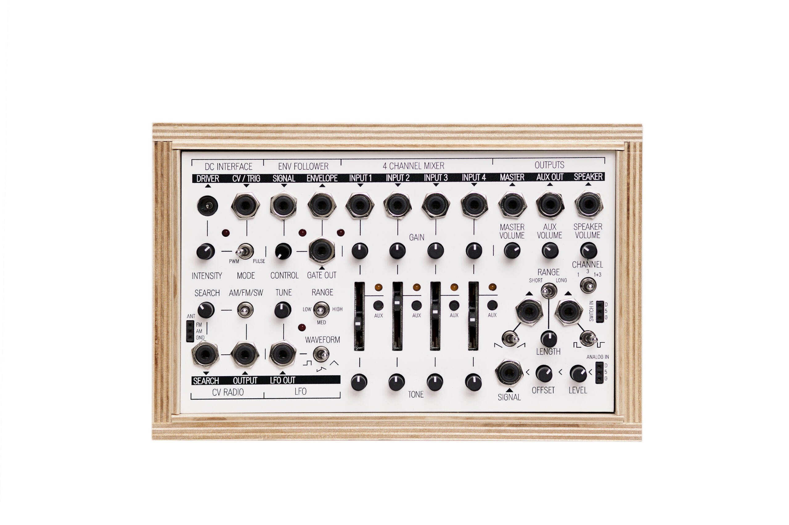

# ICU


<iframe width="560" height="315" src="https://www.youtube.com/embed/4L-uEGMK3EI" title="YouTube video player" frameborder="0" allow="accelerometer; autoplay; clipboard-write; encrypted-media; gyroscope; picture-in-picture" allowfullscreen></iframe>

# Synopsis

'ICU' is an immersive interactive sound installation made from a networked collection of interactive devices and custom software that renders data from the faces of the audience and their movements. 

14 speakers and 3 screens surround the visitor with sound, light and images. A giant screen with abstract data towers over the visitor. An interactive scenario is projected on two screens that flank a camera reading the visitor's facial expression. The left screen encourages the visitor to move while sharing their emotion. The right screen projects the data extracted from the visitor and reveals associated images and classifications.  

At the same time, the data harvested by the AI facial recognition system are sonified to reveal the hidden processes at work. These sounds are diffused around the visitor: 9 ceiling speakers create a sound cloud and 5 speakers at ear-level create the data sonifications, emitting an array of digital crackles and arpeggiated granular melodies.

The system exposes the classifications that allow this machine to understand what it sees. Sound is used to reveal these secretive processes and to create an experiential reflection of the workings of this technology.

<iframe width="560" height="315" src="https://www.youtube.com/embed/gGE5BQmqg_Y" title="YouTube video player" frameborder="0" allow="accelerometer; autoplay; clipboard-write; encrypted-media; gyroscope; picture-in-picture" allowfullscreen></iframe>

# Artists Statement
In 2021, the continuing challenges of COVID-19 have exacerbated governmental strategies the world over in surveilling their population (Tidy 2020). The ubiquity of modern technology, our obsession with it and its newfound multifaceted approach to recording our every move is being leveraged by those in power at an unprecedented scale. This work stands as a form of resistance and reflection, a moment to reflect on what it means to be surveilled by a rhizomatic entity. The work stands not to turn the tide on technological progress, but to pose questions of who the technology is for, and to reveal the secrets of the black box of facial recognition.

By interacting with the work, the act of surveillance becomes a dialogue. An improvisation that exposes the power dynamic held between something that watches and one who understands they are being watched. Any chance at understanding the impact of surrendering personal liberties will require a revelation to the electorate, especially as to what powers remain after the crisis. As Harari (2020) notes ‘Temporary measures have a nasty habit of outlasting emergencies’. To intervene and  reveal the powers that have been introduced requires a new embodied form of surveillance, one that is no longer silent and secret. The work reveals the complexity of AI powered surveillance in a playful embodied system that empowers and educates the observed.

The work is split into 3 devices:

- The Electrostatic Cloud 
- The Melodic Facial Landscape Reader
- The Harmonious Classifier

The Electrostatic Cloud is the first you encounter. This instrument listens to the stream of information rendered from the environment around you - spatialised above the observed’s head. Created using a system that listens to the live data in the space - a hint at other systems that are tracked through data. The Temperature, electromagnetic pulses, and waves out of the range of human hearing are transformed into the hearing range and spatialised above the observed in a metaphorical cloud of static pulses and snippets of ethereal voices. 

When the system finds a face the system moves into generating a composition from the observed - The Melodic Facial Landscape Reader. Each classification from the rendered data is transformed into sound. The melodies are formed from the feature landscape of the observed’s face. Each distance translated to a probability weighting for a sequencer. The melody is further augmented by predicted age - and the texture of the sound by more classifications of gender and the confusion inherent in the probability bias of the machine. The emotional expression of the features is used to influence the mood of the melody, the scale and direction of the composition influenced by a smile or frown. The sound is further distorted by aggression or surprise - the whole symphony of sounds rendered from a simple expression.

Finally, this melody is harmonised by a final instrument - The Harmonious Classifier- that reveals through sound ‘harmonic’ matches in the data. Faces that it dreams correlate to the features it can see - the data of which you hear and the classifications appear as visual indicators on the screens in front of you. The information here is created by reverse-engineering the library that the algorithm was trained on  and the data sonified for the user to understand through sound how the machine understands what it sees.

Each instrument reveals these flawed incomplete machine 'thoughts'; disembodied systems of rules, and classifiers that try to render flawed impressions of emotions. Revealing these systems to the physical senses exposes a technology that is used to categorise us by the topography of our faces. How can a machine compare your smile against a corrupted dataset, and who trained it to think it could understand the bend of a lip? When you can interact with flawed reasoning, what does it say? 

This work is a chance to reimagine new forms of interaction with these silent observers to reveal their secrets (Birchall 2015) and bias; hacking the core technology and building new outputs to allow the observed to explore the information rendered from them without their consent. But what experiences can emerge interacting with an entity that only wants to know your surface features? 

Utilising 8 speakers to create a dome of sound alludes to our new nature of listening, one constantly bombarded with new sounds that are unnatural.

>Immersion creates a new mode of perception and embodiment incorporating a history of listening and cultural memory...immersive sound design as composition is a way of taking control of the soundscape and counteracting the distracted listening that the media world promotes (Droumeva 2005) 

The work looks to create new instruments that explode normally silent systems into sound - one that alerts the audience that they are being watched by an entity.  Sonifying the rendered data of facial landmarking and revealing the classifications the systems produce when presented with a face. The biases inherent in the classification library are revealed. Repurposing open source libraries and building new reactive software is a resistance of the vectoralist class by the hacker class (Wark 2015 & 2016).

>‘all contending classes have to operate within an infrastructure increasingly designed to the specifications of the vectoral class, which not only subordinates the hacker class to it, but all other classes as well.’ (Wark 2016)

Resisting the informational surplus streams requires a repurposing of the collection technology, as a gift to the hackers’ (artists’) audience; an extension of Stewart Brand's (1987) comment: ‘Information wants to be free’.  These new instruments allow the ears to expose the talons of the vectoralist vulture and repurposes its devices as a new sensory entertainment for its subjects.

A code against code approach liberates the information constrained within these platforms to be free, to dance and play and interact, as the hacker class would intend it to be. However, it requires constant intervention to stay unconstrained. Through experimentation with pre-existing systems, the work exposes new ways to interact with them, joining new systems that were never intended on becoming bedfellows.

The work looks to join a new technological counterculture, and add to the arsenal of works that use sound as a method of resistance. Inspiration is found in the ideas of Artveillance (Brighenti 2009) and the work of artists such as Jasmine Guffond and Sam Kidell who look to sound as a possibility of resisting the encroaching technological eavesdroppers. A new form of digital relational aesthetic is activated that utilises the audience and their data as it’s palette, their face as inspiration, and surveillance algorithms as a catalyst for new compositions.

But what does a normally silent surveillance system sound like? 
The created soundscape explores the voice a security system could have, both metaphorical and actual. Each person's interaction with the system becomes their story, their conversation with the system. The aesthetic sonic choices resolve in the artist's ear, created with inspiration from the fetishistic technologies of modern electronic experimental music as a reaction to rhizomatic surveillance. Taking inspiration from works by Holly Herndon’s ‘Chorus’ and ‘Home’ (2014), and Mark Pritchard’s ‘One Way Mirror’ (2020), a hyperreal electronic soundscape emerges that is both full of the detritus of digital electronic soundscapes but resonant in human choices and decisions. 

The techniques of creation that reside within studio experimentation are part of the practice here, heavily utilising custom web software and repurposed off the shelf code, alongside traditional electronic instrumentation, modular synthesis, Ableton Live and Max MSP. Machine learning leveraging the open-source nature of code in 2021 is also implemented as both an instrument and compositional tool. Markov chains become the compositional decision makers, alongside the mathematically generated voices of WaveNet. The modern experience is one captivated by the lights and sounds of the machines and digital assistants that follow us. To give a new voice to these machines a practice emerges that plunders the culture of self-surveillance.

The problems inherent in this interactive work though is to find beauty and a ‘sublime experience’ (Supper, 2013) for the participant. A balance between revealing the simplicity behind the processes, not becoming one dimensional to the participant, but creating a playful multilayered experience.

Teaching the user these new systems and revealing its data has been done in other works, such as the excellent ‘How Normal Am I’ (Sherp, 2020), the reactionary installations of Studio Moniker and the work and writings of both Joy Buolamwini and Kate Crawford. The techniques here though normally rely on a visual reaction. A problem with a reliance on the eyes is it is a poor sense to understand the multidimensionality of the processes at large. It reveals a very black and white story of fixity within the system and with a reliance on the eyes and its associated technological user interface. 

>‘...listening does not find its actuality in a source but performs the interrogation of what that might be.’ (Voegelin, 2012)

Interactions with a system through sound may alter your perception of it and create praxis of the embodied work. The structure of the generated compositions can reveal how data is heard, restoring listening as a resistance against the binary fixity opinions of both our own eyes and the equivalent digital agents. Performance and audience interaction with these systems reveal themselves as playful improvisations, so the intent of these actions can be analysed through the physical senses - no longer virtual but experienced. This playful cycle of improvised exploration can lead to a process that not only educates but prompts political action.


# Thesis

## SOUNDING SECRECY

### REVEALING AND RESISTING UBIQUITOUS CONTEMPORARY SURVEILLANCE THROUGH SOUND
[Thesis Link Dropbox .pdf](https://www.dropbox.com/s/usbd2gzmq97k554/Smith%20Alan%20%28Bob%29%20MA20.pdf?dl=0)


# Project Diary

## Experiment 1
Date Sept 31 2019


### What?
Choral Audio Test 01
[SOUNDCLOUD CHORAL](https://soundcloud.com/boblet/choral-audio-test-01/s-8kBu3)
<iframe width="100%" height="20" scrolling="no" frameborder="no" allow="autoplay" src="https://w.soundcloud.com/player/?url=https%3A//api.soundcloud.com/tracks/680500142%3Fsecret_token%3Ds-8kBu3&color=%2351864e&inverse=false&auto_play=false&show_user=true"></iframe><div style="font-size: 10px; color: #cccccc;line-break: anywhere;word-break: normal;overflow: hidden;white-space: nowrap;text-overflow: ellipsis; font-family: Interstate,Lucida Grande,Lucida Sans Unicode,Lucida Sans,Garuda,Verdana,Tahoma,sans-serif;font-weight: 100;"><a href="https://soundcloud.com/boblet" title="TAM (The Average Man)" target="_blank" style="color: #cccccc; text-decoration: none;">TAM (The Average Man)</a> · <a href="https://soundcloud.com/boblet/choral-audio-test-01/s-8kBu3" title="Choral Audio Test 01" target="_blank" style="color: #cccccc; text-decoration: none;">Choral Audio Test 01</a></div>

I created a choral audio test - based on some white noise and manipulated samples of the voice. The initial idea is to look at giving a computer a multiplicious voice. I wanted to see if I could create something that wouldnt be too boring that created the sound of the machine and was obviously mechanical but using generated phonemes sampled and sequenced.


#### Concept - Why did I do this?
In order to understand the aesthetics of machine voices.


#### Ambition - Why does this matter?
To give the machines voices is to reveal them - what is the aesthetic nature of these voices?


#### Results - 
I personally like the results - however the response from the group triggered a range of emotions :

Boredom from some -  I can agree
Others thought it too continuous….that there was no breath to the voices
This is an interesting comment and maybe that makes it the machine. THe idea of a lack of breath could be useful in hiding any humanity in a voice - is this more powerful than a glitch in the imagination? Maybe not but an interesting concept.
---

## Experiment 2
Date 2 Oct 2019

### What was done
[Mini mix](https://soundcloud.com/boblet/dmsa-listening-guide-minimix)
<iframe width="100%" height="20" scrolling="no" frameborder="no" allow="autoplay" src="https://w.soundcloud.com/player/?url=https%3A//api.soundcloud.com/tracks/692661133%3Fsecret_token%3Ds-pN5Pv&color=%2351864e&inverse=false&auto_play=false&show_user=true"></iframe><div style="font-size: 10px; color: #cccccc;line-break: anywhere;word-break: normal;overflow: hidden;white-space: nowrap;text-overflow: ellipsis; font-family: Interstate,Lucida Grande,Lucida Sans Unicode,Lucida Sans,Garuda,Verdana,Tahoma,sans-serif;font-weight: 100;"><a href="https://soundcloud.com/boblet" title="TAM (The Average Man)" target="_blank" style="color: #cccccc; text-decoration: none;">TAM (The Average Man)</a> · <a href="https://soundcloud.com/boblet/dmsa-listening-guide-minimix/s-pN5Pv" title="DMSA Listening Guide / MiniMix" target="_blank" style="color: #cccccc; text-decoration: none;">DMSA Listening Guide / MiniMix</a></div>

#### Concept - Why did I do this?
I wanted to create a little point of reference to my historic work to ensure that aesthetically I do not (or do) deviate from the work that has come before. This contains work from early work as [The Average Man](https://open.spotify.com/artist/3boQxzuvkSpIRhX3JfNJeF?si=mBkz4unTRxaen9njjU58zw) 
<iframe src="https://open.spotify.com/embed/artist/3boQxzuvkSpIRhX3JfNJeF" width="300" height="380" frameborder="0" allowtransparency="true" allow="encrypted-media"></iframe>
through to [Lil Bo Bleep](https://soundcloud.com/lil-bo-bleep) work and then installation and hack work.

#### Ambition - Why does this matter?
I wanted to maintain some core aesthetics from previous projects. A listening reference is useful to diverge or build on previous output.

#### Results - 
I can already see by adding in the last experiment that to the end of the mix that I need to be more aggressive in my sound choices, I wanted to look back at my work to see what still resonated, as well as share the results with the group. Unfortunately this did not occur but it is still useful for introverted listening.

---

## Experiment 3
Date 10 OCt 2019

### What was done?
Live jam with new sounds alongside my normal pallet of sounds to refind the work that I was doing before. Utilising my live set with some of the washes from previous experiments and using some fm synth work with heavy overdrive I created some other controllers using theramins as input.
[FUZZ FM OVERDRIVE](https://soundcloud.com/boblet/first-fuzz-fm-overdrive/s-09NVJ)
<iframe width="100%" height="20" scrolling="no" frameborder="no" allow="autoplay" src="https://w.soundcloud.com/player/?url=https%3A//api.soundcloud.com/tracks/693465352%3Fsecret_token%3Ds-09NVJ&color=%2351864e&inverse=false&auto_play=false&show_user=true"></iframe><div style="font-size: 10px; color: #cccccc;line-break: anywhere;word-break: normal;overflow: hidden;white-space: nowrap;text-overflow: ellipsis; font-family: Interstate,Lucida Grande,Lucida Sans Unicode,Lucida Sans,Garuda,Verdana,Tahoma,sans-serif;font-weight: 100;"><a href="https://soundcloud.com/boblet" title="TAM (The Average Man)" target="_blank" style="color: #cccccc; text-decoration: none;">TAM (The Average Man)</a> · <a href="https://soundcloud.com/boblet/first-fuzz-fm-overdrive/s-09NVJ" title="First Fuzz (FM OVERDRIVE)" target="_blank" style="color: #cccccc; text-decoration: none;">First Fuzz (FM OVERDRIVE)</a></div>

#### Concept - Why Did I do this?
To try and find a more active sound pallet that is more in keeping with my previous work - experiment with some new synthesizers

#### Ambition - Why does this matter?
I wish to build on my work rather than reinvent the sound pallet completely. 

#### Results - 
The results are much more aesthetically pleasing. It maintains my connection to club culture that was missing, but I feel that the sound could be pushed further. The use of a guitar as an instrument and the theremin reflect some of the work I am trying to build with, but its not in keeping wioth the concept.
---

## Experiment 4
Date 30 OCT 2019

#### What did I do?
Utilising Lyrebird as a voice generation program….
[Voice](https://soundcloud.com/boblet/8-audio-0001-2019-10-24-221956)
<iframe width="100%" height="20" scrolling="no" frameborder="no" allow="autoplay" src="https://w.soundcloud.com/player/?url=https%3A//api.soundcloud.com/tracks/701266948%3Fsecret_token%3Ds-4YPwb&color=%2351864e&inverse=false&auto_play=false&show_user=true"></iframe><div style="font-size: 10px; color: #cccccc;line-break: anywhere;word-break: normal;overflow: hidden;white-space: nowrap;text-overflow: ellipsis; font-family: Interstate,Lucida Grande,Lucida Sans Unicode,Lucida Sans,Garuda,Verdana,Tahoma,sans-serif;font-weight: 100;"><a href="https://soundcloud.com/boblet" title="TAM (The Average Man)" target="_blank" style="color: #cccccc; text-decoration: none;">TAM (The Average Man)</a> · <a href="https://soundcloud.com/boblet/8-audio-0001-2019-10-24-221956/s-4YPwb" title="8 - Audio 0001 [2019 - 10 - 24 221956]" target="_blank" style="color: #cccccc; text-decoration: none;">8 - Audio 0001 [2019 - 10 - 24 221956]</a></div>
I recorded over 40 readings in order to generate a voice clone via AI Software Lyrebird.

#### Concept - Why Did I do this?
I want to be able to give voice to machines - and I thought that some tests with actual machine generated voices could be useful.

#### Ambition - Why does this matter?
I am looking to capture participants voices - currently this has been touted as a fast way to create machine generated voices...


#### Results
I was hoping that the voices would be more like myself - however currently they are far too synthetic. Any quality is MASKED by the digital nature of the voices… This definitely feels like technology on the cusp - but still that - I only hear glimpses of myself in the voices - and others don't hear me at all. 

---

## Experiment 5
Date 4 Nov 2019

### What did I do?
[Slit scan experiment](https://youtu.be/LSviEkwfoZg)
<iframe width="560" height="315" src="https://www.youtube.com/embed/LSviEkwfoZg" frameborder="0" allow="accelerometer; autoplay; clipboard-write; encrypted-media; gyroscope; picture-in-picture" allowfullscreen></iframe>

Utilising Processing I wanted to look at the visual aspect of the work - slit scanning is a great tool for playing with time - and to hook a user IN - if they are to improvise with a space then they need to feel like they are playing.

#### Concept - Why did I do this?
I want to record people in time and get them to move their movement and behavior being used to generate and alter the composition. - for them to react I need something ‘fun’ just as the major sp’s like google  use services to extract behavior as a surplus.I built a series of magic ‘mirrors’ that look at video over time...

#### Ambition - Why does this matter?
Interaction needs investment and encourages a playful audience this is a way that reveals recording in a playful way.

#### Results - 
The slit scan is a great part as it utilises the body as its input and shows that people are being recorded. It had my kids dancing infrnt of it for some time so the playfulness is there - but without the extra layer of interaction it feels passive.
---

## Experiment 6
Date 7 Nov 2019

### What did I do?




Live jam with some body controled modular synths built in RACK and processing - experimenting with some contact controllers into my [Koma Electonic](https://koma-elektronik.com/?product=field-kit) Field kit. This is triggering some CV controls into a Volca Modular.

I reworked this into a composition:
[Middle Rhythm 2](https://soundcloud.com/boblet/middlerhythm-02)
<iframe width="100%" height="20" scrolling="no" frameborder="no" allow="autoplay" src="https://w.soundcloud.com/player/?url=https%3A//api.soundcloud.com/tracks/707908156%3Fsecret_token%3Ds-Gm9p8&color=%23862c43&inverse=false&auto_play=false&show_user=true"></iframe><div style="font-size: 10px; color: #cccccc;line-break: anywhere;word-break: normal;overflow: hidden;white-space: nowrap;text-overflow: ellipsis; font-family: Interstate,Lucida Grande,Lucida Sans Unicode,Lucida Sans,Garuda,Verdana,Tahoma,sans-serif;font-weight: 100;"><a href="https://soundcloud.com/boblet" title="TAM (The Average Man)" target="_blank" style="color: #cccccc; text-decoration: none;">TAM (The Average Man)</a> · <a href="https://soundcloud.com/boblet/middlerhythm-02/s-Gm9p8" title="MiddleRhythm 02" target="_blank" style="color: #cccccc; text-decoration: none;">MiddleRhythm 02</a></div>

#### Concept - Why Did I do this?
To see what kind of sounds were created by using the body as a controller - and if they can be tuned to an existing composition. Utilising signal data to control synthesis.

#### Ambition - Why does this matter?
I was hoping that sensors would work - but without experience this isnt conducive - it also is not passive but active - I feel like the machine should react to motion and vibrations in the room as much as sound and vision - to give it another sense

#### Results - 
Nice composition but the controllers seem too sporadic uncontrollable and fraught with failure-  great for sound design - but unusable for the general public unless subtle or desensitized - for example: a background pad with its subtle lfo's mapped to parameters.
---
## Experiment Date 10 Nov 2019

### What was done
SO here is a first Sonification test in processing
[Matching video and data mapped to a synth…](https://youtu.be/RQ1XXCvKtXQ)
<iframe width="560" height="315" src="https://www.youtube.com/embed/RQ1XXCvKtXQ" frameborder="0" allow="accelerometer; autoplay; clipboard-write; encrypted-media; gyroscope; picture-in-picture" allowfullscreen></iframe>

#### Concept - Why Did I do this?
Utilising slit scan words and sound to create immersion - alongside generated compositions taken from the Kinect reading depth within the room

#### Ambition - Why does this matter?
How does reactive sound change the experience? 

#### Results 
Its definitely interesting - but the composition is too threatening - no one would be drawn in. The words being distorted by the depth camera is something that might make it into the final piece - the idea that it is also

## Experiment Date 07 March 2020

### What was done
So taking samples recorded of followers I started to build synths using their voices
Test of allot of the sound design so far - almost all the sounds come from 2 sources - processed sounds of my own social media followers telling me that they are watching me - the other is from foley field recordings from data centers captured by various sources. - The modulations / automations of the tracks / synths are handled by custom facial recognition software.

All of the reverbs used are from impulse responses from Teufelsberg - an NSA listening tower
https://soundcloud.com/boblet/watching-test/s-oDhhEz8f3mc
<iframe width="100%" height="166" scrolling="no" frameborder="no" allow="autoplay" src="https://w.soundcloud.com/player/?url=https%3A//api.soundcloud.com/tracks/825847699%3Fsecret_token%3Ds-oDhhEz8f3mc&color=%23e6bdcb&auto_play=false&hide_related=true&show_comments=true&show_user=true&show_reposts=false&show_teaser=false"></iframe><div style="font-size: 10px; color: #cccccc;line-break: anywhere;word-break: normal;overflow: hidden;white-space: nowrap;text-overflow: ellipsis; font-family: Interstate,Lucida Grande,Lucida Sans Unicode,Lucida Sans,Garuda,Verdana,Tahoma,sans-serif;font-weight: 100;"><a href="https://soundcloud.com/boblet" title="TAM (The Average Man)" target="_blank" style="color: #cccccc; text-decoration: none;">TAM (The Average Man)</a> · <a href="https://soundcloud.com/boblet/watching-test/s-oDhhEz8f3mc" title="Watching Test 003" target="_blank" style="color: #cccccc; text-decoration: none;">Watching Test 003</a></div>

(NB extra rerender here)
https://soundcloud.com/boblet/6-audio-2-2020-10-23-080038-im-watching-you-startup-sample/s-415ko6vzFZa
<iframe width="100%" height="20" scrolling="no" frameborder="no" allow="autoplay" src="https://w.soundcloud.com/player/?url=https%3A//api.soundcloud.com/tracks/968810032%3Fsecret_token%3Ds-415ko6vzFZa&color=%23e6bdcb&inverse=false&auto_play=false&show_user=true"></iframe><div style="font-size: 10px; color: #cccccc;line-break: anywhere;word-break: normal;overflow: hidden;white-space: nowrap;text-overflow: ellipsis; font-family: Interstate,Lucida Grande,Lucida Sans Unicode,Lucida Sans,Garuda,Verdana,Tahoma,sans-serif;font-weight: 100;"><a href="https://soundcloud.com/boblet" title="TAM (The Average Man)" target="_blank" style="color: #cccccc; text-decoration: none;">TAM (The Average Man)</a> · <a href="https://soundcloud.com/boblet/6-audio-2-2020-10-23-080038-im-watching-you-startup-sample/s-415ko6vzFZa" title="6 - Audio 2 [2020 - 10 - 23 080038] - I&#x27;m Watching you startup Sample" target="_blank" style="color: #cccccc; text-decoration: none;">6 - Audio 2 [2020 - 10 - 23 080038] - I&#x27;m Watching you startup Sample</a></div>


#### Concept - Why Did I do this?
Can a voice be constructed from acts of sousveillance
#### Ambition - Why does this matter?
A new idea to hear what can be created 

#### Results 
Its definitely interesting - spooky but not really the aesthetic I was looking for - I am watching you is not a phrase that really I dshould have chosen

---

## Experiment 
Date Friday 28 FEB 2020

#### What
Lighting test Millimin 
#### Concept - Why Did I do this?
I want to create a surrounding entity to the interactions - a feeling of envelopment. I want to see if I can create reactions within millimin to control a simple dmx lighting rig and screen that reacts to. 

#### Ambition - Why does this matter?
I wanted to maintain focus in the installation drawing in - I have no experience with the DMX rig in the SDL - so I wished to use Millimin ad a brain for the lighting / projection of the installation. Learning a new piece of software - Millimum to see if it is useful. Millimin can take projections out of processing for projecting via syphon - this seems to work nicely - then utilising OSC you can control scenes.

#### Results - 
The experiment was slightkly unsuccesful there needs to be a smaller throw to the lights - maybe some LED strips would be more useful and control them - also the lighting effected the input of the Kinect something I was not anticipating - if lighting is to be used it should LIGHT the participants not sillhouette them - moving heads might be better but the univercity does not have any.


---

## Inspiration 
### Date August 1  2020
the bias and power imbalance of algorithms - Joy Buolamwini's websites a nice jumping off point as is [Kate Crawford](https://www.katecrawford.net/) her interview on Dryhursts & Herndons Interdependance podcast is a great listen

[Algorithmic Justice League - Unmasking AI harms and biases] (https://www.ajl.org/)
---
## Experiment 
Date Tuesday 6th October 2020

### What
[Facial recognition test](https://github.com/boblete/Facial-Recognition-Sonification-Test)

#### Ambition - Why does this matter?
After writing the thesis I now have more focus - I wish to explore sounds ability to target the body at a distance - facial recognition is one of the those issues that is plagued with bias and bad data. It is also another modern day silent observer, a secret power, that is known but unknown - ripe for a revealtion. To reveal it through sound is to give it a voice - to hear its presence - whether that be literal or metaphorical. Unclear as to what that would be - but the possibilities start with a hacking experiment - can I find a open source code solution that utilises biased data - but can be built upon. Turning to github returns a single JS library that looks perfect - and one that might have a virtual Covid-19 solution. 

#### Results - 
We can track faces in the browser with a webcam - this is successful - what is more interesting is the opensource hackable nature of the code. [Face-api.js](https://github.com/justadudewhohacks/face-api.js/) is used with various open source libraries that are part of the wider infrastructure that facial identification and feature extraction is built upon. This is also open source as is the image sets that the data is trained on - that will prove useful in revealing its true nature to an audience.

---

## Experiment 
Date Thursday 13th-sat 17th October 2020

### What
[Facial recognition test 2](https://github.com/boblete/frst-MA-DMSA)

#### Ambition - Why does this matter?
First test combining facial recognition software and react - the framework that I will use to help with basic UI display. Thius will form the backbone of the codebase for both a browser AND a installation piece.

#### Results 
So this is the first test at seeing if we can make the webapp porthin - the test is totally successful - I am able to make a fingerprint in data of faces based on FACE-API then test to see if the Algorhythm will find them again - this totally works - scanned every member of the family and having a full face recognition test - need to find the bias issues noted in the git-lab - the software allegedly fails on non-biased faces - we need to set a timeout on the camera / recognition connection  - and also if the face returns undefined then we request that they store them - 

This has sparked thoughts about how the app should work - the web portion should reveal and allow us to surrepticiously collect information about the user.

So we can get their IP address - 
We could ask them to post their fingerprint - sharing is an excellent circumnavigator of security as peoples willingness to sousveil themselves and share themselves will be key to gleaming information from them. -> shre location add nsa hashtag to a tweet along with a visual fingerprint.

What if the installation does nothing unless you sign up - your face goes ignored unless registered? what does that say? 

We should be able to give a multilayered effect - need to understand what each section of sound will be.

---
## Inspiration 
[Machine Listening festival](https://www.unsound.pl/en/intermission/machine-listening)
Excellent bunch of lectures by likeminded researchers.

2nd October - Re-watch here: Against The Coming World of Listening Machines

3rd October - Register here: Lessons In How (Not) To Be Heard 

4th October - Register here: Listening With The Pandemic

To quote Liquid Architecture: “Amidst oppressive and extractive forms of state and corporate listening, practices of collaborative study, experimentation and resistance will, we hope, enable us to develop strategies for recalibrating our relationships to machine listening, whether that be through technological interventions, alternative infrastructures, new behaviors, or political demands. With so many cultural producers - whose work and research is crucial for this kind of project - thrown into deeper precarity and an uncertain future by the unfolding pandemic, we also hope that this project will operate as a quasi-institution: a site of collective learning about and mobilisation against the coming world of listening machines.”

---
## Experiment 
Date Thursday 20th October 2020

### What
[Facial recognition test 003](https://github.com/boblete/frst-MA-DMSA)

#### Ambition - Why does this matter?
Trying to work out if I can get information out of the face api that I can use for instrumentation online

#### Results - 
Sucess - I can now map faces record face fingerprints and sonify them in tone.js - visualisation is handled by SVG graphics currently

[](https://www.youtube.com/watch?v=v_lw2GM6sqo)
It doesnt sound like my face currently - its  a mess really but fun.
---
## Experiment 
Date Thursday 20th October 2020

### What
Facial recognition test 003
https://github.com/boblete/frst-MA-DMSA

#### Ambition - Why does this matter?
This is a new branch to look at expression recognition data set - I can get it running internally with the recognition but extracting the data for my own uses is proving elusive - however might be able to GREP the output.

#### Results - 
Still not working need to understand how to test faces without just the UI output of FACEAPI framework - more learning will  be needed.


---
## Experiment 
Date saturday 23rd October 2020

What
[Facial recognition test 003 https://github.com/boblete/frst-MA-DMSA](https://github.com/boblete/frst-MA-DMSA)


#### Ambition - Why does this matter?
This is a new branch to look at expression recognition data set


#### Results - 
Still stumped - rolling back - but getting:


---
## Inspiration 
[hownormalami](https://www.hownormalami.eu/)
In this test face detection algorithms will determine how normal you are. 100% privacy friendly.

Excellent video based online art based on facial recognition algorhythms
---
## Workshop 
Date Tuesday 2nd November 2020
Hearing the Impossible with Matthew Herbert 

### What
THis workshop looking at scoring impossible sounds - what would those sounds be - the score I have created looks at the idea of the sounds that could be possible
[Full Score](https://docs.google.com/document/d/e/2PACX-1vS5Ps-nOxtMvAhwB6AkO9HxmTy3NkAGuvVg-vMKmyYusN1PAFhZitU1lRim27pNXF67h4jNN_SEukNv/pub)


This Method of working resonates with the way I like to work and outputs possibilities of new sounds within the imagination - which is exactly what I need to motivate me at this time.
---
## Experiment
Thursday 5th November 2020 MORNING
Facial recognition test 004 
#### Ambition - Why does this matter?
Trying to at least register all the features I can gleam from each moment
Changing the sound design to something more delicate so it draws the user in - something brutal reveals anger - but really if the user is KNOWN then it should draw them in with delicacy - the magic of prediction is what is intruiging here - can we play a CHORD based on emotion - can we create an algorithmic chord progression - something that moves through the whole circle in an upwards fashion - each time we get to a chord we trigger a face check for the 'next' chord - if it is operating correctly then we should be able to OVERLAY the last 2 if we can fade OUT 
Syncing the TIME to a tone timeline - 
It would be great if FINDING a face fingerprint changed the rhythm of the piece - if we are drawing grids COULD we have a bunch of tone instruments with teeny tiny samples in them that are triggered by the numbers? If we are mapping to grey scale simply then we can map to a midi value? 

#### Results
Now utilising vanvas parameter binding I can utilise the extra face API models to write out the labels:
also want to quickly use ffmpeg to create mp3 versions of ABLETON jams for aifs - this works
 for i in *.aif; do ffmpeg -i "$i" -vn -ar 44100 -ac 2 -b:a 192k "${i%.avi}.mp3"; done

 After playing with this for a while I am not hearing a face - the compositional instrument does not seem to sound like the mesh - so maybe I need something more delicate - I like the Idea of playing with really long delay times and fading the canvas back though time 


---
## Experiment
Thursday 5th November 2020 AFTERNOON
Facial recognition test 005 


#### Ambition - Why does this matter?
Fixing up the more compositional issues - and running things from TONE timelines...
All the timers are now tied to tone itself - the idea here is to run the engine through to TONE - as the ONLINE synthesis engine

#### What Happened?
The tests compiled properly with a few minor bugs.

#### What was revealed?

It sounds more musical  but Its too busy - there is sooo much data we need a way of shaping the sound not through pitch but through rhythm and texture.Or the data needs filtering
theres also a bug in 2 faces that shows up as an issue that I am only passing 1 variable to the face not splitting them - needs addressing that the labeling is uniform...

---
## Experiment 
Date Tuesday 10 November 2020

### What was done
Sound Design Test
[experiment-10-nov-01](https://soundcloud.com/boblet/experiment-10-nov-01/s-t3H9KG2PPXJ)

<iframe width="100%" height="300" scrolling="no" frameborder="no" allow="autoplay" src="https://w.soundcloud.com/player/?url=https%3A//api.soundcloud.com/tracks/926612206%3Fsecret_token%3Ds-x3NgkGGL7rT&color=%23ff5500&auto_play=false&hide_related=false&show_comments=true&show_user=true&show_reposts=false&show_teaser=true&visual=true"></iframe><div style="font-size: 10px; color: #cccccc;line-break: anywhere;word-break: normal;overflow: hidden;white-space: nowrap;text-overflow: ellipsis; font-family: Interstate,Lucida Grande,Lucida Sans Unicode,Lucida Sans,Garuda,Verdana,Tahoma,sans-serif;font-weight: 100;"><a href="https://soundcloud.com/boblet" title="TAM (The Average Man)" target="_blank" style="color: #cccccc; text-decoration: none;">TAM (The Average Man)</a> · <a href="https://soundcloud.com/boblet/experiment-10-nov-02/s-x3NgkGGL7rT" title="Experiment 10 nov 02" target="_blank" style="color: #cccccc; text-decoration: none;">Experiment 10 nov 02</a></div>


#### Ambition - Why does this matter?
Looking at sound design that explores the themes of Security in sound

#### Results - 
It has become more ambient - I am not too happy about the ups and downs of the chord progression - its too negative - some aspects of the glitchy sound design are hitting the spot for me - need to work more on the musical aspect - it needs to sound more pensive - more suspensful


---
## Experiment + Research
Date Tuesday 17 November 2020
collecting images from the data sets to gain inspiration about what is going on and the bias of the images and data sets....
 

## Experiment 
Date Tuesday 19 November 2020
What did I do
Looking at Audio from previous experiments as a backing to the installation.
Seems odd to force a narrative onto an improvisation - but looking at it looks interesting for scenes.
How we cans shift scenes - shifting emotional states - the shift in emotion 


## Inspiration 

This is the inspiration for the next experiment Based on this work: One Way Mirror by Mark Pritchard
<iframe src="https://open.spotify.com/embed/track/03rEqExKHDpzCBSrdOwEwu" width="300" height="380" frameborder="0" allowtransparency="true" allow="encrypted-media"></iframe>
Mark Pritchard words are here:

```
Do you feel secure?
At Hell City Technologies, you can surf in a clean cyber-ocean with no ads, trackers, malware, or phishing attempts. We guard your personal data by using industry-league EAMC276GQM encryption. It's only seven cents a day to secure your digital life. Use Cloakable. Terms and conditions apply

Cities are about people. By improving the human experience, we enhance this city. At the Digital Transparency Collective, our aim is to combine IOT (Internet of Things) and ICT (Information Communication Technology) to optimise the efficient selection of operations and radically improve our new life

The Mindfulness Corporation present the wonders of frequency medication. Are you having trouble sleeping? All creatures, and even plants, need sleep. Using academic research combined with pamphlets and wind chimes, we guarantee increased productivity, performance, and profitability. Subscribe to Mindfulness now and discover that nothing is possible

Welcome to Nuanced Solutions module 1: Building Trust In Your Brand. Say "trust". You can trust us (You can trust us). We can be trusted. Increase emotional connection. You can trust us (You can trust us). We can be trusted (We can be trusted). You can trust us (You can trust us). We can be trusted. At Nuanced Solutions, we believe that algorithms don't feel but people do. Please subscribe today

Digital transparency, data trust, nine trackers blocking, in a smart city. Digital transparency, data trust, image de-identified, in a smart city. Citizen empowerment, data trust, RTB network scrambled, in a smart city. A new visual language for data transparency, voice de-identified, in a smart city

The community that sings together, stays together. Smart city, smart governments. Smart energy, smart building. Smart mobility, smart infrastructure. Smart technology, smart healthcare, smart citizens
```

[via Genius](https://genius.com/Mark-pritchard-one-way-mirror-lyrics)

## Experiment 
Date Monday 24th November -
Experiment
Give the machine a voice to ask the user to play the instrument
I created this short sequence:
[iamsaferobot](https://soundcloud.com/boblet/iamsafe-voicebot/s-7VmkiGmLmXg)

I want to get someone who knows words better to collaborate with the voice of the machine - as in some stock phrases of what we can say.

Currently I wrote a short script That I gave to various Wave net modeled voices to speak -
[wavenet](https://cloud.google.com/text-to-speech/docs/wavenet)

`Say Trust...I can be trusted. You can trust us. smile. create OUR emotional connection. Look at all the emotion we can make. Show me your sadness. I can help you. I can love you. We are making Emotions together. I can be trusted with your emotions. Your emotions remind me of someone. Why do I make you angry. Why can you not be happy. I did not mean to suprise you. I am Sorry. Let me make you happy. You can trust my voice. I am Safe. I am not looking at you. I am looking away.`

also looking at the enclosure of reason:
[The-Inclosure-of-Reason](https://technosphere-magazine.hkw.de/p/The-Inclosure-of-Reason-ecTsvnENeC1GXtmgRNaMH9)
his creation hymn, opens with the paradox of creation:
```नासदासीन्नो सदासीत्तदानीं नासीद्रजो नो व्योमा परो यत्```
Translated as “not the non-existent existed, nor did the existent exist then":Anonymous, trans. Wendy Doniger O’Flaherty, “Nasadiya Sukta,” Rig Veda (10:129). Harmondsworth: Penguin Classics, 1981.  the hymn negotiates the limit of creation with one of the earliest recorded instances of agnosticism – that precondition for a human reason unburdened by theological imperative, and the earliest flicker of a nascent humanism:

```
Who really knows? 
Who will here proclaim it?
Whence was it produced? Whence is this creation?
The gods came afterwards,  with the creation of this universe.
Who then knows whence it has arisen?
Anonymous, trans O’Flaherty, “Nasadiya Sukta,” Rig Veda (10:129).  
```

It is precisely this agnostic attitude at the root of humanism, itself a regard for the limits of human reason, which needs to be reoriented in the direction of those forms of artificial intelligence (AI) developing today. An attitude that compels modesty in its open admission that the inhuman may elude our epistemological framing of intelligence itself.

## Experiment 
### Date Thursday 26th November -
### What was done
I created this composition that is an indication of the direction in which I want it to travel:
https://soundcloud.com/boblet/sounddesign_installation_26_no/s-9RlcU7ElOiF
<iframe width="100%" height="300" scrolling="no" frameborder="no" allow="autoplay" src="https://w.soundcloud.com/player/?url=https%3A//api.soundcloud.com/tracks/936415834%3Fsecret_token%3Ds-9RlcU7ElOiF&color=%23e6bdcb&auto_play=false&hide_related=true&show_comments=false&show_user=true&show_reposts=false&show_teaser=false&visual=true"></iframe><div style="font-size: 10px; color: #cccccc;line-break: anywhere;word-break: normal;overflow: hidden;white-space: nowrap;text-overflow: ellipsis; font-family: Interstate,Lucida Grande,Lucida Sans Unicode,Lucida Sans,Garuda,Verdana,Tahoma,sans-serif;font-weight: 100;"><a href="https://soundcloud.com/boblet" title="TAM (The Average Man)" target="_blank" style="color: #cccccc; text-decoration: none;">TAM (The Average Man)</a> · <a href="https://soundcloud.com/boblet/sounddesign_installation_26_no/s-9RlcU7ElOiF" title="soundDesign_Installation_26_Nov_2020" target="_blank" style="color: #cccccc; text-decoration: none;">soundDesign_Installation_26_Nov_2020</a></div>

The idea is there is a general sound of static interlaced with voices. This composition plays on some of the modes that the machine can move into. The states of its performance - but the reality is that it is just 

It is the presence of a person detected by machines that creates the composition
THe machine can talk to you - still unclear whether this is a real voice or a projected text voice
Currently treating the robot voice as a source of focus for the work.

#### Results 

I need to play it to a few people my initial thoughts are that its in the right direction but all a bit samey - however a response from a TOMTOM developer was this:
Alone
Drifting
moving slowly
Amongst liquid and nature
confused
Being programmed/monitored
Fragmented
Yey 303!
Artificial intelligence 
Structured
MK Ultra MK2


I may need to compose 5 movements - and also Male Female / age related textures that can be revealed

I want the work to provoke so I need better writing - time to get professional help

In collaboration with Emma Kelly from brightondrama.co.uk we have started to characterise the machine.
The Idea is that she/he/they is a clever but narcissistic silicone valley child in an adults body.

Incredibly shallow. ONly really interest in consuming and harvesting you to for data. It requires a character to attempt to illicit responses. What if the surveillance machine gets bored and wants to provoke you into making trouble - especially one so naive that it cannot understand its place in the world. Its only intent is reading you - and categerising you and once it is done it ignores you


###### Meeting with Emma Kelly from Brighton Writers Friday 27th November


How do you make people feel X - how does it want to feel
WHo is your audience - how do you persuade THEM
What is the Reality of that interaction in play 
Some will be amused…some may be cross
If it does X to an audience What is the response? 
Pose some declarations or questions to your audience.
Motivation and tactic.

What is its Personality?
- Immature cheeky Not aware as it makes out…
- MAybe it says something mean or complimentary
- Then it can get hurt and offended.
- It might get stuck somewhere
- Sillicone valley slut
- narcissistic personality disorder.
- Generic 
- Incredibly shallow.

Tactics for responses.
What can you show them to lead them into an amotional state AND can that really be read in a gallery setting?

You need spacing within that composition to HEAR their effect in it slow it down

Be the AI Teasing out emotions.
Visuals - threads responses.

#### Work to do: 
- [ ] Write up the character persona
- [ ] Write a game based story narrative tree
- [ ] Work on the sound design - AND with a projector (to show yourself as a mirror) the maschine can also diplay images to provoke you. This is pulling inspiration fromn China's street screen cameras where they reveal they are watching you. 

Possibility that a sign board - like a bus stop shelter is the best innocuous item for delivering this. 
Speak to Clive about how this might work (Again time to get professional help).

###### Meeting with Clive Ramble from 1st December

### What was done
Clive builds installations for a living - so this was a first discussion of a plan for the installation - after talking to Clive need to take it in a direction and firm up sizes - utilising this mix as a point of reference for us both
https://soundcloud.com/boblet/sounddesign-installation-panning-1dec/s-aQ7NCnO5ORC

The idea of a freestanding billboard rings true - but the possibility of having it built to stand outside may be cost prohibitive and too expensive (as is the ability to run power to it. I think this has firmed my idea that if it is an installation (post covid please!) 


#### Ambition - Why does this matter?
The ideas here is to plan several versions and work out the simplest way to implement a test to get up and running for the final show  before getting results and building something that can be toured. 


## Experiment 
### Date Thursday 3rd December 
### What was done
More sound design
https://soundcloud.com/boblet/sounddesign6/s-Az7LwCuquuB
<iframe width="100%" height="300" scrolling="no" frameborder="no" allow="autoplay" src="https://w.soundcloud.com/player/?url=https%3A//api.soundcloud.com/tracks/940525996%3Fsecret_token%3Ds-Az7LwCuquuB&color=%23766c6c&auto_play=false&hide_related=true&show_comments=false&show_user=true&show_reposts=false&show_teaser=false&visual=true"></iframe><div style="font-size: 10px; color: #cccccc;line-break: anywhere;word-break: normal;overflow: hidden;white-space: nowrap;text-overflow: ellipsis; font-family: Interstate,Lucida Grande,Lucida Sans Unicode,Lucida Sans,Garuda,Verdana,Tahoma,sans-serif;font-weight: 100;"><a href="https://soundcloud.com/boblet" title="TAM (The Average Man)" target="_blank" style="color: #cccccc; text-decoration: none;">TAM (The Average Man)</a> · <a href="https://soundcloud.com/boblet/sounddesign6/s-Az7LwCuquuB" title="soundDesign6" target="_blank" style="color: #cccccc; text-decoration: none;">soundDesign6</a></div>

The main thing I like here is the synth - its still same but using ROUNDS with its ability to sound similar but altered will realy help the work - matched with the Markov chain model of DrChaos in ableton this is a very nice quick way to achieve the endless music that I think the piece deserves - also very simple - so the Notes selected could be altered by a trigger of face recognition.

MAybe the radio and phoneme glitches that happen later on work better. 

It feels much more melancholic in this version - let us try a test where we get the machine ton sense all 5 states

Be interesting to see if we can load up the randomiser in 5 different versions based on what states the machine sees

https://soundcloud.com/boblet/sounddesign5/s-6vR94RDjM7S
<iframe width="100%" height="300" scrolling="no" frameborder="no" allow="autoplay" src="https://w.soundcloud.com/player/?url=https%3A//api.soundcloud.com/tracks/940533811%3Fsecret_token%3Ds-6vR94RDjM7S&color=%230e3864&auto_play=false&hide_related=true&show_comments=false&show_user=true&show_reposts=false&show_teaser=false&visual=true"></iframe><div style="font-size: 10px; color: #cccccc;line-break: anywhere;word-break: normal;overflow: hidden;white-space: nowrap;text-overflow: ellipsis; font-family: Interstate,Lucida Grande,Lucida Sans Unicode,Lucida Sans,Garuda,Verdana,Tahoma,sans-serif;font-weight: 100;"><a href="https://soundcloud.com/boblet" title="TAM (The Average Man)" target="_blank" style="color: #cccccc; text-decoration: none;">TAM (The Average Man)</a> · <a href="https://soundcloud.com/boblet/sounddesign5/s-6vR94RDjM7S" title="soundDesign5" target="_blank" style="color: #cccccc; text-decoration: none;">soundDesign5</a></div>


THis version plays with a more classic 70s eno vibe (7th) instrument that is adequate but the neural net sometimes picks unsutable notes in the markov chain with the octave randomiser - makes it sound more like Queens 'Flash Gordon' to my ears which is NOT what I was expecting - if we use this then we need to look at sorting out the models

#### Ambition - Why does this matter?
In light of Kerstens comments regarding the non dancability of the installation - looking at a more conceptual idea of the installation soundtrack that doesn't lean on my normal dance music tropes - but instead looks more towards the clean digital sounds. Utilising audio fingerprints - and the wave table form  - still unsure if the machine should be voiced - it is almost too blatant - 

## Experiment 
Date Sunday 6th - Monday 7th December
### What was done
Redoing the sound design using a different synth per last facial expression.

[Sound Design 7](https://soundcloud.com/boblet/sounddesign7/s-TObBlpgMt6o)
<iframe width="100%" height="300" scrolling="no" frameborder="no" allow="autoplay" src="https://w.soundcloud.com/player/?url=https%3A//api.soundcloud.com/tracks/943085572%3Fsecret_token%3Ds-TObBlpgMt6o&color=%231f1f1f&auto_play=false&hide_related=true&show_comments=false&show_user=true&show_reposts=false&show_teaser=false&visual=true"></iframe><div style="font-size: 10px; color: #cccccc;line-break: anywhere;word-break: normal;overflow: hidden;white-space: nowrap;text-overflow: ellipsis; font-family: Interstate,Lucida Grande,Lucida Sans Unicode,Lucida Sans,Garuda,Verdana,Tahoma,sans-serif;font-weight: 100;"><a href="https://soundcloud.com/boblet" title="TAM (The Average Man)" target="_blank" style="color: #cccccc; text-decoration: none;">TAM (The Average Man)</a> · <a href="https://soundcloud.com/boblet/sounddesign7/s-TObBlpgMt6o" title="soundDesign7" target="_blank" style="color: #cccccc; text-decoration: none;">soundDesign7</a></div>

[cables](https://cables.gl/edit/5fcf5d06dd01fb43f15dfef2)
---


### What was revealed
This really is the culmination of allot of different experiments over the weekend. I felt that a flow state was achieved in this practice revealing synthesis that resonated with the ideas of unrandom randomness generated within these systems. The algorhythms are triggering little state machines - snapshots in ableton that really resonate artistically. I feel I can push this further with feedback but the concept is working. Timings and the fingerprinting system are still up for grabs - but the aesthetic is getting closer to my initial vision of how this should sound. 

A break down of the elements can be heard here:
[I Can Be Trusted](https://soundcloud.com/boblet/sets/i-can-be-trusted-sonic/s-wdK1pjsv8C7)
<iframe width="100%" height="300" scrolling="no" frameborder="no" allow="autoplay" src="https://w.soundcloud.com/player/?url=https%3A//api.soundcloud.com/playlists/1197679558%3Fsecret_token%3Ds-wdK1pjsv8C7&color=%231f1f1f&auto_play=false&hide_related=true&show_comments=false&show_user=true&show_reposts=false&show_teaser=false&visual=true"></iframe><div style="font-size: 10px; color: #cccccc;line-break: anywhere;word-break: normal;overflow: hidden;white-space: nowrap;text-overflow: ellipsis; font-family: Interstate,Lucida Grande,Lucida Sans Unicode,Lucida Sans,Garuda,Verdana,Tahoma,sans-serif;font-weight: 100;"><a href="https://soundcloud.com/boblet" title="TAM (The Average Man)" target="_blank" style="color: #cccccc; text-decoration: none;">TAM (The Average Man)</a> · <a href="https://soundcloud.com/boblet/sets/i-can-be-trusted-sonic/s-wdK1pjsv8C7" title="=I can be trusted Sonic Sculpture" target="_blank" style="color: #cccccc; text-decoration: none;">=I can be trusted Sonic Sculpture</a></div>

---

## Inspiration
Interdependence Podcast - 
Protocols, Permissions and non-human communication with the Indigenous Protocol and Artificial Intelligence Working Group | Holly Herndon and Mat Dryhurst on Patreon
[Podcast]( https://www.patreon.com/posts/45335690 )

[Indigenous AI ](https://www.indigenous-ai.net/ )
[Their Position Paper:](https://spectrum.library.concordia.ca/986506/7/Indigenous_Protocol_and_AI_2020.pdf )
[Professor Jason Edward Lewis](http://jasonlewis.org/ )

[Suzanne Kite]([http://kitekitekitekite.com/)


Really inspiring podcast about the issues of facial recognition and the problems of technology and indigenous cultures.

---

## Planning 
Date Sunday 17th January 
### What was done
First time back to really working on this project due to other commitments - been looking at possibilities of Covid friendly options for delivering this project - looking at 3 possible options:

- Plan A - Installation - Multichannel installation (as per original idea)
- Plan B - Website - software - interactive website delivered online in virtual space for each audience member
- Plan C - Video Demonstration of compositions

---

## Research & Experimentation
Date Saturday 23rd January 

### What was done
Looking to javascript and web platforms as a way to recreate earlier processing experiments - I need to find code that has solved some of the earlier visual problems - for example a Slit Scanner


[Slit Scan Code Pen](https://codepen.io/SarahC/pen/maGzMG)


---

(BREAK FOR WORK CRUNCH + Starting MAX MSP COURSE)

## Research & Experimentation
Date Mon 15th Feb 

### What was done
Experimenting with MAX MSP Visual Glitch Patch: 

 


(BREAK FOR WORK CRUNCH + Starting MAX MSP COURSE)


## Experimentation
Date 20th Feb 
Experimenting with ambient work
<iframe width="100%" height="166" scrolling="no" frameborder="no" allow="autoplay" src="https://w.soundcloud.com/player/?url=https%3A//api.soundcloud.com/tracks/996347884%3Fsecret_token%3Ds-8TilMtTjZAG&color=%23e6bdcb&auto_play=false&hide_related=true&show_comments=true&show_user=true&show_reposts=false&show_teaser=false"></iframe><div style="font-size: 10px; color: #cccccc;line-break: anywhere;word-break: normal;overflow: hidden;white-space: nowrap;text-overflow: ellipsis; font-family: Interstate,Lucida Grande,Lucida Sans Unicode,Lucida Sans,Garuda,Verdana,Tahoma,sans-serif;font-weight: 100;"><a href="https://soundcloud.com/boblet" title="TAM (The Average Man)" target="_blank" style="color: #cccccc; text-decoration: none;">TAM (The Average Man)</a> · <a href="https://soundcloud.com/boblet/arp-interrogations/s-8TilMtTjZAG" title="Arp Interrogations" target="_blank" style="color: #cccccc; text-decoration: none;">Arp Interrogations</a></div>

## Experimentation
Date 2nd March 
Got back into writing with some of the sounds recorded recently from data output.
https://soundcloud.com/boblet/erasedu/s-kj979wSgZUe

## Experimentation
Date Mon 16th March 

### What was done
Mixing down some tracks made with samples from the work
<iframe width="100%" height="166" scrolling="no" frameborder="no" allow="autoplay" src="https://w.soundcloud.com/player/?url=https%3A//api.soundcloud.com/tracks/1009149208%3Fsecret_token%3Ds-Dtsu0nNsFvz&color=%23e6bdcb&auto_play=false&hide_related=true&show_comments=true&show_user=true&show_reposts=false&show_teaser=false"></iframe><div style="font-size: 10px; color: #cccccc;line-break: anywhere;word-break: normal;overflow: hidden;white-space: nowrap;text-overflow: ellipsis; font-family: Interstate,Lucida Grande,Lucida Sans Unicode,Lucida Sans,Garuda,Verdana,Tahoma,sans-serif;font-weight: 100;"><a href="https://soundcloud.com/boblet" title="TAM (The Average Man)" target="_blank" style="color: #cccccc; text-decoration: none;">TAM (The Average Man)</a> · <a href="https://soundcloud.com/boblet/cityscape-erased-u-studio1/s-Dtsu0nNsFvz" title="Cityscape Erased U STUDIO1" target="_blank" style="color: #cccccc; text-decoration: none;">Cityscape Erased U STUDIO1</a></div>

## Experimentation
Date Mon 18th March 

### What was done
Restarting coding Face synth - combining all the experiments so far
Nothing to report opther than the slit scanner kept my kids entertained for about an Hour (whilst the AI was in the background happily recording their faces features and landmarks) - the idea of distraction is working

## Experimentation
Date Mon 20th March 

### What was done
Starting to combine face grabbing technology with react

The idea here use several experiments and work them togethere

## Experimentation
Date Mon 24th March

### What was done

Final show inspires me to try to start combining all the elements even more -> loading in insecure cameras from across the world into the page...

More face synth changes

 

## Experimentation
Date Mon 25th March 

### What was done
In studio 1 and Performance studio
Looking at logistics of producting a system in the performance studio
There are some technical issues that occur here

How many machines will I need to run this work 
The visuals heat up my machine somewhat and need to operate in the foreground - that then needs to send data to another machine that plays the audio?

It's fine for the static one the websafe one is a simulation of what might be. Scanning faces 

Problems of scale ->
doesnt find faces unless you are really close->
CAn I use syphon on another machine thats joining all the feeds -> OR use a camera over IP security system that is scanned
Problems with project linkup -> cable really flaky ask for cat 5 connector on back wall.

Can we get the DMX lighting rig to fire spots at the audience - Just need 1 Deep spot and a restful mode.

ALSO Make sure the small text is at the bottom -
Text needs to be much bigger:
if they are to read and understand.


Audio in studio 1
Need to out put everything as samples and spend some time chopping up for tone to consume
We can then load up all the voices and get them to trigger....
Each face last emotion triggers the audio
The synth is made up of the 16 patterns still -> however I would like to look at how the synth can trigger events via Midi other than read in and quantise - what can be achieved in a live environment

Need a noise where other faces are found.

Need to formulate script properly
Need to callibrate the face recognition to read from Canvas...
To do that we need to sort the stream - I think it needs a better design as a piece.
If the larger interactions are now at the bottom as possibly a tryptich


## Experimentation
30 March
The browser is becoming alive
Started using loops of the audio installation in ableton 
but mapping them into the tone web audio context


SO using multiply loops with volume crossfades seems to work - but the main synth needs design - maybe utilising a software version would work much better with all the values then actually generating real things.

This is definately going in 2 directions - the installation is much more fully formed
But the web version allows you to play with your face more....

But its getting laggy needs optimising

## Experimentation
5 april
Issues with the camera -

I cannot use directly the Machine learning on the external camera system. CORS (security) errors taint an image.
Security protocols need to be white hatted - so the issue here is that security on insecure webcam feeds is that you cannot get at the feed - However there is a white hat method of roundtripping the image via a camera you own - This is a common technique that through physical means can over turn techs digital resatrictions - and is a really good technique for remembering the physical presence and the powers that are held withing the physical.

## EP
7 April
Demo of music created with the sounds - this has been on the back burner but managed to find some time to craft some compositions using the material I collated
<iframe width="100%" height="166" scrolling="no" frameborder="no" allow="autoplay" src="https://w.soundcloud.com/player/?url=https%3A//api.soundcloud.com/tracks/1019815270%3Fsecret_token%3Ds-STjGLPzObyk&color=%23e6bdcb&auto_play=false&hide_related=true&show_comments=true&show_user=true&show_reposts=false&show_teaser=false"></iframe><div style="font-size: 10px; color: #cccccc;line-break: anywhere;word-break: normal;overflow: hidden;white-space: nowrap;text-overflow: ellipsis; font-family: Interstate,Lucida Grande,Lucida Sans Unicode,Lucida Sans,Garuda,Verdana,Tahoma,sans-serif;font-weight: 100;"><a href="https://soundcloud.com/boblet" title="TAM (The Average Man)" target="_blank" style="color: #cccccc; text-decoration: none;">TAM (The Average Man)</a> · <a href="https://soundcloud.com/boblet/cityscape-erased-u-studio2/s-STjGLPzObyk" title="Cityscape Erased U STUDIO2" target="_blank" style="color: #cccccc; text-decoration: none;">Cityscape Erased U STUDIO2</a></div>

## Experimentation
10 April
Research 
https://www.nationalgeographic.com/science/article/face-mask-recognition-has-arrived-for-coronavirus-better-or-worse-cvd

Face mask leraning models - Interesting Idea but can't get hold of a copy.


## Experimentation
5-22 April
### What was done
Intensive work on the web version of exploring the audio work.


Love how this one is finding a face in a bottle.


#### Concept/Ambition - Why Did I do this?
SO the web version is moving towards completion - concentrating now on the central panel of the tryptic.
I need to be more focused in each section

#### Results - 
The center panel is where you explore your own face. This requires a machine that can face track - store face landmarks and then store them. It also tracks emotion.
I'm now using TONE.js for the sound. 

Issues currently are with hosting and bugs.
Sound issues are that I need to re render compositions that sound more like the emotions. Faces recognition working - and the model is as accurate as I can make it for a webcam - the issue is with playback - 

Sound design needs more work - spatialisation also needs more work.


## Installation Experimentation
22 April

### What was done
Set up a rudimentary version running on a laptop in the studio to test rear projection -


#### Concept/ Ambition
Trying out rear projection in the performance space. Need to know whats possible.
How to attatch cameras - how to keep it all tidy -

#### Results - 
SO Lighting is not my friend - I need it to be dark but not dark -the shadows need to be minimised for the face detector to work.

Biggest issue is that the faces are too small to work at a distance - might need to get a bigger camera -> utilise the webcam

Main things to understand ->
What camera should I use and where to rig it. 
SHould I be using 3 screens or just 1 big one? could do the tryptic more simply on 1 big screen split into 3 - maybe start with that as it's already complex
How can I cable all the other systems to make it cleanly rigged - Is there a fake platform or similar.

How can I keep all the equipment safe and cable free ?

I need to link allot of systems and I really need to get my head round how many machines:
Left
1 machine projecting cams (probably a PI) for simplicity
1 laptop reading it? -> MAX MSP _>Jitter

Canter 
1 Machine - Running web patch -> audio

Right 
1 Machine reading faces -> playing max patch.

All joined via OSC - recieving to central brain -> 
Left laptop running max+ jotter could be one machine + Brain - Center and right could be another

Procesor intensive would be MAX -> but the more machines I can use the better - just unsure whether I can connect them all

Ideally the projection would be on a separate machine runnning syphon.

extra help from: 
https://www.jroehm.com/2015/10/18/a-simple-guide-to-use-osc-in-the-browser/


##  Experimentation
23 April

### What was done
Setting up Joto to perform my impossible sounds.
https://www.instagram.com/p/COA4fscn1JkVukKoKdbqfdK47C6hCTBLU1Ry6A0/
The joto (A robot drawing machine) will recieve a score transmitted through IFTT (internet of things protocols) and then draw (or 'jot') a score for the imagination.
Score for Accidental records
https://www.instagram.com/p/COIgeKHnf8llJQ3UbkynJmGhT1EtFBRSJoojuA0/


##  Experimentation
1 May

### What was done
Experimentation in the performance studio

Looking at what kind of setup would support the installation with regards to surround

Originally looking at using an ambisonic dome. However I cannot get the envelop software that I am using at home to communicate with the system here dues to numbering
Looking at abletons mappings it appears I can set up 2 quad systems.

##  Experimentation
10 May
https://www.instagram.com/p/COqtbZPHcHrPebFSwZoE-Qb-tM_lC0fckqa6T40/
Documenting - The Electrostatic Cloud - this collection of instruments listens to the invisible sounds around us - radio-waves - electromagnetic chirps - and ethereal voices that inaudibly envelop our world -- here I am tuning the temperature controlled envelope that chops the sounds - Samplr on loop pedal duty replaying some of the best moments to give the system some rhythm and something for the ear to hold onto.

##  Experimentation
17-18 May

### What was done
Midi protocol tests.

I am now looking at mapping directly into the sound design system.
Mapping the live data through midi is much less processor intensive - allowing the sounds to become more dynamic
And the processor load to be spent on the AI - should be able to remove some frameworks along the way

Mapping Diagram as follows:


##  Inspiration
19 May

Discovered this wheel that is the perfect data set for extracting emotional reference points from the data

each of the points on the map are actually perfect jumping off points for the AI descripters.

Peaceful -> Neutral
Mad -> Angry
Scared -> Fearful / Surprised
Sad-> Sad
Joyful-> Happy

Powerful here is not relevant - but could be incorporated into Peacefuk.


##  Mixdown
20 May

### What was done
Finished mixing down tracks that form the basis for the inspiration. These are part of my submission for AGM93
https://soundcloud.com/boblet/sets/ep-demo-i-c-u/s-BXXnLjGD9Sk

Alan (Bob) Smith ICU (DEMO) E.P. 01 Are_You_There?
Demo of a track created from the Melodic Facial Landscape Reader data of myself and close family over the course of lockdown 3. Frustration both personal - residing in one place and that of living through the camera - through zoom based alienation.

Alan (Bob) Smith ICU (DEMO) E.P. 02 Rhizomatic Cityscapes
`This composition was created with data using the Widerface and Tinyface training sets with the Melodic Facial Landscape Reader. The camera was trained o THe pace of life made me realise this as a more frenetic composition.

Alan (Bob) Smith ICU (DEMO) E.P. 03 Arp Pareidolia
Here I was basing the composition using data collected from the miscellany. The capturing of faces that were imagined in the machinery. Machine-driven pareidolia that lent itself to a more natural graceful composition.

##  Floor Plan
21 May

### What was done
Sat with the measurements from the performance studio to create a rough floor plan (not quite to scale - needs remeasuring) 

This seems to have some successful outcomes in that the cable runs are long enough need to setup the extra rear speakers in the setup though to ensure everything works together - I have lost a screen folding the other two around the ringlight camera.


##  Experiment
22 May

### What was done
Screen projection mapping plan
So the optima short throw needs mapping 

So with a 6x9 projection I should be able to make 2 screens at 69inches x 78 inches (thats a 78x139 inch screen cut in half losing half an inch on each side) these can be mounted from the floor at a 10 degree angle offcenter that should minimise any shadow within the blackour border.

The issue is that I want to 'angle' the screens around the camera which with a center projector will leave a border. However this should allow be to utilise 2 screens that are vertical with a black border in the middle - the middle section will be blacked out to stop the audience getting blinded - I may have to organise some felt on a separate frame around the camera if the effect is too blinding - but I do need to illuminate the subjects.


So in order to complete the calculations I need this information from  the projector manual:


This states that
Screen (Diagonal) of 139 inches
screen size 131.2 x 73 inches

leaving 30 CM from the floor
at a distance of 5 Meters 
though there is a 1.2x zoom so we should be able to get the size we require at a distance of 4.16m still a meters and a half shy of the 2.5m I was hoping for for this to work we might have rotate the aspect slightly.

##  Experiment
23 May

### What was done
Midi return values
Need to map the audio system back to the AI-> 
So sending midi out so I can time intervals - using IAC device that I am connected to I just need to set up a receiver that logs out information -
### why
So the Idea here is that some of the musical mappings are held in ableton - if we can map the midi output back to the web software we can do lots and lots of things - like have the arpegiattor trigger the visuals.


##  Press
25 May
### What was done
So my Accidental editions need some press shots:

/Users/bobsmith/Documents/GitHub/boblete.github.io/media/EA0F5B74-1133-40C1-8A1B-046D94A8A86F.JPG


##  Experiment
25 May
### What was done
Editing my own version of envelops ambisonics

THis shows the steps needed to create the patch:
currently we have 7 ceiling speakers and 4 earlevel speakers and 2 subwoofers in the system (see floorplan)

So we have 
Ceiling
3       4
5   6   7
8       9
Floor
10      11
12      13
Subwoofer
15      16

SO in order to map this to the setup we need to decode using the speaker positions subpatch in Max
This subpatch defines the position of all the speaker channels, with the arguments: n a e d

n: Output channel number [1-...]
a: Azimuth (in degrees)
e: Elevation (in degrees)
d: Distance (generally recommend using 1.)

we can assume that the ceiling speakers are at elevation of +40 except for the center speaker 6 which we can locate at 90 -we then change the distance to be .60 to be the same height as the others that are angled.

Ceiling
3 : 1 -45. 40. 1.
4 : 2 45. 40. 1.
5 : 3 -90. 40. .80
6 : 4 0. 90. 0.60
7 : 5 90. 40. 0.80
8 : 6 -135. 40. 1.
9 : 7 135. 40. 1.
Floor
10 : 8 -45. 0. 1.
11 : 9 45. 0. 1.
12 : 10 -135. 0. 1.
13 : 11 135. 0. 1.

15 - the subs come off channel 1 ambisonics with -3db should be adequate - 
16 - the subs come off channel 1 ambisonics with -3db should be adequate - 


I especially want to use brownian motion with an expanding box (to simulate a throbbing brain)

In the overheads - I have this working really nicely in the quad system but it would sound even better if the whole system was linked.... hence wanting to creat the whole sound dome.

SO with all these numbers now programmed in I can do this:


##  Experiment
3 June 2021
### What was done
Tryout in the Performance studio 

Lots went wrong today. 
The speaker system doesnt work properly and the whole kit mis behaving
None of the speakers (genelecs) worked

I need to sort this with Bob on tuesday. Need to use the MAckies not the Genelecs- and run separate systems rather than an ambisonic sound dome.

I did tweak the E4l so it matches channels 15 16 17 18

Laastly (and something I can do this weekend)
The software is really buggy - dropping faces and lagging - 
Spent the evening optimising now plotting points and all running OUTSIDE of react - > just a request frame JS loop

Things I learnt is that the await takes too long and we ccan optimise using offscreen context


TODO: We can await matches that trigger a chord.
So midi in triggers an await that then triggers midi back.
stores the last midi
and then reexports it.

##  Experiment
4 June 2021
### what was done?
Coding test rewriting all the software and performance enhancements

Getting closer but need to redo the clocks
Getting laggy again - but running 2 canvases super fast.


## Mix
7 June
### what was done?
[MIXTAPE](https://drive.google.com/file/d/1gbPJA_icMYUDjejIzQ8AKMM66bgusejV/view?usp=sharing)
A first pass at a mix. For my musical projects I have always created a playlist and mix - I feel that this time my mix should include inspirational podcasts too as well as music.

##  Experiment
8 June 2021
### What was done
Setup in the Performance studio 
Rewired speakers with Bob Morton - got in Mackies and the back projector and brought in more computers to split the load - still running a bit slow - might have to split the screen load into 2 1 computer running the learning the other the surveilance alogrhythm.

##  Building
9 June 2021
### What was done
Made some screens - the problem is the boxing in not really working as too wobbly need to add the boxes for stability - If I put 1 on the bottom and 2 side sections on each end this should work - joining the 2 should then work to stabilise the other arm so it's all straight.

Brynn has offered help - but not really sure what measurents yet need to mock up.
